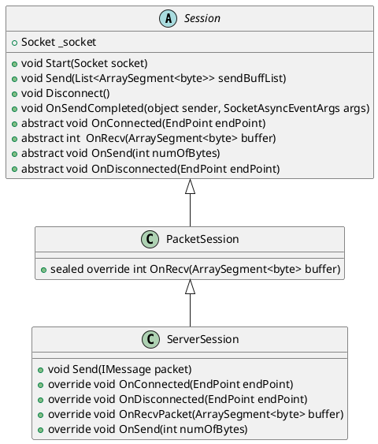

## Table of contents
{: .no_toc .text-delta }

1. TOC
{:toc}

---

* [Get Code 🌟](https://github.com/Arthur880708/LetMakeMMO/tree/1)

---

  

```puml
@startuml 123
abstract class Session {
  +Socket _socket
  +void Start(Socket socket)
  +void Send(List<ArraySegment<byte>> sendBuffList)
  +void Disconnect()
  +void OnSendCompleted(object sender, SocketAsyncEventArgs args)
  +abstract void OnConnected(EndPoint endPoint)
	+abstract int  OnRecv(ArraySegment<byte> buffer)
	+abstract void OnSend(int numOfBytes)
	+abstract void OnDisconnected(EndPoint endPoint)
}

class PacketSession {
  +sealed override int OnRecv(ArraySegment<byte> buffer)
}

class ServerSession {
  +void Send(IMessage packet)
  +override void OnConnected(EndPoint endPoint)
  +override void OnDisconnected(EndPoint endPoint)
  +override void OnRecvPacket(ArraySegment<byte> buffer)
  +override void OnSend(int numOfBytes)
}

Session <|-- PacketSession
PacketSession <|-- ServerSession
@enduml

```