## 주요 클래스 관계도

```plantuml
@startuml
class UNetDriver {
  +ClientConnections[]
  +ServerConnection
  +CreateChannel()
}

class UNetConnection {
  +Channels[]
  +OpenChannels[]
  +SendBuffer
  +PacketHandler
}

class UChannel {
  +Connection
  +SendBunch()
  +ReceivedBunch()
}

class UControlChannel
class UActorChannel
class UVoiceChannel

class PacketHandler {
  +HandlerComponents[]
  +Outgoing()
  +Incoming()
}

UNetDriver "1" *-- "*" UNetConnection : manages >
UNetConnection "1" *-- "*" UChannel : owns >
UNetConnection "1" *-- "1" PacketHandler : has >

UChannel <|-- UControlChannel
UChannel <|-- UActorChannel
UChannel <|-- UVoiceChannel

note right of UNetDriver
  서버: ClientConnections[] 보유
  클라이언트: ServerConnection 보유
end note

note right of UChannel
  Control Channel: 연결 제어
  Actor Channel: 액터 복제
  Voice Channel: 음성 데이터
end note
@enduml
```



<p align="center">
  
</p>

---

## 흐름도

```plantuml
@startuml
participant "Network Socket" as Socket
participant "PacketHandler" as Handler
participant "NetConnection" as Connection
participant "Channel" as Channel
participant "Game Logic" as Game

== 수신 흐름 (Incoming) ==
Socket -> Handler: Raw Packet
Handler -> Connection: Processed Packet
Connection -> Channel: Bunch
Channel -> Game: Game Data

== 송신 흐름 (Outgoing) ==
Game -> Channel: Game Data
Channel -> Connection: Bunch
Connection -> Handler: Packet
Handler -> Socket: Processed Packet
@enduml
```



<p align="center">
  
</p>

```cpp
class UNetConnection
{
private:
    FSocket* Socket;
    TUniquePtr<FPacketHandler> PacketHandler;

public:
    // 소켓으로부터 데이터 수신
    void ReceiveRawPacket()
    {
        uint8 Buffer[MAX_PACKET_SIZE];
        int32 BytesRead = 0;
        
        // 소켓에서 raw 데이터 읽기
        if (Socket->Recv(Buffer, MAX_PACKET_SIZE, BytesRead))
        {
            // PacketHandler를 통한 전처리
            if (PacketHandler)
            {
                if (PacketHandler->ProcessIncoming(Buffer, BytesRead))
                {
                    // 처리된 패킷을 FBitReader로 변환
                    FBitReader Reader(Buffer, BytesRead * 8);
                    
                    // Channel로 데이터 전달
                    ReceivedPacket(Reader);
                }
            }
        }
    }

    // 패킷을 Channel로 라우팅
    void ReceivedPacket(FBitReader& Reader)
    {
        // 패킷 헤더 읽기
        FPacketHeader Header;
        Reader << Header;
        
        // 적절한 Channel 찾기
        if (UChannel* Channel = Channels[Header.ChIndex])
        {
            // Channel로 Bunch 전달
            Channel->ReceivedBunch(Reader);
        }
    }
};
```

```cpp
class UChannel
{
public:
    void SendData(const FGameData& Data)
    {
        // Bunch 생성
        FOutBunch* Bunch = new FOutBunch(this);
        
        // 게임 데이터 직렬화
        Bunch->WriteObject(Data);
        
        // Connection으로 전달
        Connection->SendBunch(Bunch);
    }
};

class UNetConnection
{
public:
    void SendBunch(FOutBunch* Bunch)
    {
        // Bunch를 패킷으로 변환
        FBitWriter Writer;
        Writer.WriteBytes(Bunch->GetData(), Bunch->GetNumBytes());
        
        // PacketHandler 처리
        if (PacketHandler)
        {
            PacketHandler->ProcessOutgoing(Writer);
        }
        
        // 소켓으로 전송
        Socket->Send(Writer.GetData(), Writer.GetNumBytes());
    }
};
```