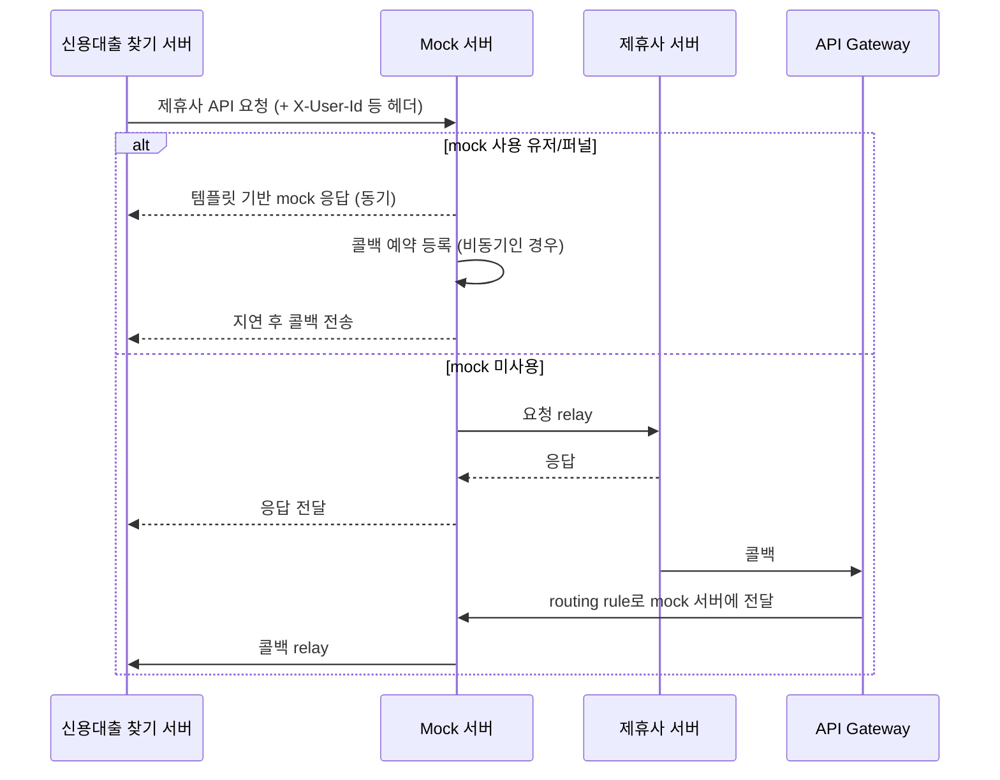



# 신용대출 찾기 제휴사 Mock 서버 개발기 정리

## 1. 배경

신용대출 찾기 서비스는 여러 제휴사(은행, 저축은행, 보험사 등)의 API를
호출해 가심사 조회 → 대출 신청 → 대출 실행 퍼널을 처리한다.

개발/QA 단계에서 다음 문제가 반복됐다.

- 제휴사 개발 서버의 불안정한 응답, 장애
- 특정 퍼널·고객 조건에 맞는 테스트 데이터 확보가 어려움
- 제휴사 서버에서 유효한 응답을 받기 어려움

결과적으로 QA 효율 저하, 신규 기능 개발 지연, 출시 일정 영향이 생겼다.

---

## 2. 요구사항

### 기능

- 유저 / 제휴사 / 퍼널 단위로 mock 사용 여부 설정
- 동기, 비동기(콜백) 응답 모두 지원
- mock을 쓰지 않는 요청은 실제 제휴사로 전달 (relay)
- 쉽게 조작할 수 있는 설정 UI

### 비기능

- 기존 비즈니스 로직 변경 없음
- 설정값은 커스텀 헤더로 전달
- 다른 서비스에서도 재사용 가능한 구조

---

## 3. 전체 구조



---

## 4. 구현 상세

### 4.1 커스텀 헤더 주입

기존 로직을 건드리지 않고, HTTP 클라이언트 레벨에서 헤더를 추가한다.
`@Profile("dev")` 로 개발 환경에서만 동작한다.

RestTemplate 인터셉터:

```kotlin
class MockServerHeaderInjectionInterceptor : ClientHttpRequestInterceptor {
  override fun intercept(
    request: HttpRequest,
    body: ByteArray,
    execution: ClientHttpRequestExecution,
  ): ClientHttpResponse {
    val headers = request.headers
    headers.add(MOCK_SERVER_HEADER_X_REQUEST_ID, "ids")
    headers.add(MOCK_SERVER_HEADER_X_USER_ID, "userId")
    return execution.execute(request, body)
  }
}
```

WebClient 필터:

```kotlin
private fun addMockServerHeaderFilter(): ExchangeFilterFunction {
  return ExchangeFilterFunction.ofRequestProcessor { clientRequest: ClientRequest ->
    val injectedHeaders = ClientRequest.from(clientRequest)
      .headers { headers: org.springframework.http.HttpHeaders ->
        headers.add(MOCK_SERVER_HEADER_X_REQUEST_ID, "ids")
        headers.add(MOCK_SERVER_HEADER_X_USER_ID, "userId")
      }
      .build()
    Mono.just(injectedHeaders)
  }
}
```

**예시** — dev 프로필에서만 인터셉터 등록:

```kotlin
@Configuration
@Profile("dev")
class MockServerClientConfig {

  @Bean
  fun partnerRestTemplate(builder: RestTemplateBuilder): RestTemplate =
    builder
      .rootUri("https://mock-server.dev.internal") // 제휴사 대신 mock 서버
      .additionalInterceptors(MockServerHeaderInjectionInterceptor())
      .build()
}
```

**예시** — 실제로 나가는 요청:

```http
POST /partner-a/pre-screening HTTP/1.1
Host: mock-server.dev.internal
Content-Type: application/json
X-Request-Id: 20260928-0001
X-User-Id: 1001

{ "amount": 10000000, "period": 12 }
```

### 4.2 DB 기반 설정

mock 서버가 **어떤 응답을 내릴지 DB에 저장**해 두고, 요청이 오면
조회해서 응답한다. 응답을 코드에 두지 않으므로 시나리오를 추가하거나
바꿀 때 배포가 필요 없다.

테이블마다 답하는 질문이 다르다.

| 테이블 | 답하는 질문 |
|---|---|
| `user_status` | 이 유저는 mock을 쓰나? 쓴다면 어떤 결과(승인/거절)? |
| `partner_response` | 그 결과의 응답 JSON은 어떻게 생겼나? |
| `partner_metadata` | 이 제휴사는 바로 응답하나, 나중에 콜백하나? |

요청 처리 순서 (유저 1001이 A은행 가심사를 요청한 경우):

1. 헤더에서 `X-User-Id: 1001` 을 읽음
2. `user_status` 에서 (1001, A은행, 가심사) 조회
   - 설정 없음 → 실제 A은행으로 relay 후 종료
   - `REJECTED` → 3번으로 진행
3. `partner_response` 에서 (A은행, 가심사, REJECTED) 키로 템플릿 조회
4. 템플릿의 예약어를 요청 값으로 치환 (4.4)
5. `partner_metadata` 에서 A은행의 응답 방식 확인
   - 동기: 바로 응답
   - 비동기: 콜백 예약 후 지연 시간 뒤 전송 (4.3)

테이블별 저장 항목:

| 테이블                | 역할                               |
| ------------------ | -------------------------------- |
| `partner_metadata` | 제휴사별 동기/비동기, 네트워크, 암호화 여부        |
| `partner_response` | 제휴사·퍼널별 mock 응답 JSON 템플릿         |
| `user_status`      | 유저별 mock 사용 여부, 콜백 지연, 퍼널별 응답 선택 |

응답은 `(제휴사, 퍼널, 상태)` 조합으로 찾는다.

```kotlin
val key = Triple(companyId, funnelType, status)
val response = partnerResponseService.create(key, metadata, requests)
```

**예시** — 테이블 스키마:

```sql
CREATE TABLE partner_metadata (
  company_id        VARCHAR(32) PRIMARY KEY,
  response_type     VARCHAR(8)  NOT NULL,  -- SYNC / ASYNC
  callback_delay_ms BIGINT      DEFAULT 3000,
  encrypted         BOOLEAN     DEFAULT FALSE,
  base_url          VARCHAR(255)
);

CREATE TABLE partner_response (
  id          BIGINT AUTO_INCREMENT PRIMARY KEY,
  company_id  VARCHAR(32) NOT NULL,
  funnel_type VARCHAR(32) NOT NULL,  -- PRE_SCREENING / APPLY / EXECUTE
  status      VARCHAR(32) NOT NULL,  -- APPROVED / REJECTED / TIMEOUT
  layout      JSON        NOT NULL,  -- 예약어 포함 템플릿
  UNIQUE (company_id, funnel_type, status)
);

CREATE TABLE user_status (
  user_id           BIGINT      NOT NULL,
  company_id        VARCHAR(32) NOT NULL,
  funnel_type       VARCHAR(32) NOT NULL,
  response_status   VARCHAR(32),          -- NULL 이면 relay
  callback_delay_ms BIGINT,               -- NULL 이면 metadata 값 사용
  PRIMARY KEY (user_id, company_id, funnel_type)
);
```

**예시** — 저장해 두는 응답 (A은행 가심사의 승인/거절 두 가지):

```sql
INSERT INTO partner_response (company_id, funnel_type, status, layout) VALUES
('BANK_A', 'PRE_SCREENING', 'APPROVED',
'{"result":"OK","amount":"{{amount}}","interestRate":"{{interestRate}}"}'),
('BANK_A', 'PRE_SCREENING', 'REJECTED',
'{"result":"REJECT","reasonCode":"R001","reason":"신용점수 미달"}');
```

**예시** — "1001번 유저는 A은행 가심사에서 거절, 10초 뒤 콜백":

```sql
INSERT INTO user_status VALUES (1001, 'BANK_A', 'PRE_SCREENING', 'REJECTED', 10000);
```

### 4.3 비동기 응답(콜백) 처리

2단계 예약 구조로 처리한다.

1. **예약 등록**: 요청이 오면 콜백 예약을 DB에 저장.
   실행 시각은 `schedule.executeTs`, 지연 시간은 `user_status` 또는
   `partner_metadata` 값을 사용.
2. **예약 실행**: `@Scheduled` 로 1분마다 예약을 조회하고,
   `ThreadPoolTaskScheduler` 로 실행 시각에 콜백 API 전송.
   여러 인스턴스의 중복 예약은 분산 락으로 막는다.

```kotlin
private fun reserveInternal(schedule: ScheduleEntity, forceReserve: Boolean = false) {
  handlers
    .filter { it.canHandle(schedule) }
    .forEach { handler ->
      repository.save(schedule)
      if (forceReserve) {
        schedule.reserve()
        repository.save(schedule)
        scheduler.schedule(
          { submitTask(schedule, handler) },
          schedule.executeTs.atZone(ZoneId.systemDefault()).toInstant(),
        )
        return@forEach
      }

      lockExecutor.runOnce(
        lockKey = "$LOCK_KEY_PREFIX${schedule.id}",
        lockDuration = Duration.ofMinutes(1),
      ) {
        schedule.reserve()
        repository.save(schedule)
        scheduler.schedule(
          { submitTask(schedule, handler) },
          schedule.executeTs.atZone(ZoneId.systemDefault()).toInstant(),
        )
      }
    }
}
```

**예시** — 1분 주기 폴링 부분:

```kotlin
@Scheduled(fixedDelay = 60_000)
fun pollSchedules() {
  // 다음 1분 안에 실행될, 아직 예약되지 않은 건만 조회
  val until = LocalDateTime.now().plusMinutes(1)
  repository.findAllByReservedFalseAndExecuteTsBefore(until)
    .forEach { reserveInternal(it) }
}
```

`forceReserve` 는 요청 직후 바로 등록할 때(지연이 1분 미만 등) 폴링을
기다리지 않고 즉시 스케줄러에 올리는 용도로 보인다.

### 4.4 Mock 데이터 생성 (템플릿 치환)

응답 JSON은 예약어 템플릿으로 저장하고, 요청 값으로 치환한다.

**Step 1** — 템플릿:

```json
{
 "amount": "{{amount}}",
 "period": "{{period}}",
 "interestRate": "{{interestRate}}",
 "productId": "{{productId}}",
 "id": "{{id}}"
}
```

**Step 2** — 예약어를 실제 값으로 치환 (중첩 객체·배열 재귀 처리):

```kotlin
fun replace(
  replaceParams: Map<String, String>,
  node: JsonNode,
): JsonNode {
  when {
    node.isObject -> {
      val objectNode = node as ObjectNode
      objectNode.fields().forEach { (key, value) ->
        replaceParams.forEach { (keyword, replaceKeyword) ->
          if (value.asText() == keyword) {
            objectNode.put(key, replaceKeyword)
          }
        }
        replace(replaceParams, value)
      }
    }
    node.isArray -> {
      val arrayNode = node as ArrayNode
      arrayNode.forEach { replace(replaceParams, it) }
    }
    node is Collection<*> -> {
      node.filterIsInstance<JsonNode>()
        .forEach { replace(replaceParams, it) }
    }
  }
  return node
}
```

결과:

```json
{
 "amount": "10000000",
 "period": "12",
 "interestRate": "2.4",
 "productId": "OOO 자동차 담보 대출",
 "id": "{{id}}"
}
```

**Step 3** — 상품명을 기준으로 원장 ID 매핑.
같은 객체 안의 상품명 필드(`propertyNames`)를 읽어 `{{id}}` 를 채운다.

```kotlin
private fun replace(
  propertyNames: List<String>,
  keyword: String,
  replaceKeywordByPropertyNames: Map<String, String>,
  node: JsonNode,
) {
  when {
    node.isObject -> {
      val objectNode = node as ObjectNode
      val propertyName = propertyNames.firstNotNullOfOrNull {
        objectNode.get(it)?.asText()
      }

      objectNode.fields().forEach { (key, value) ->
        if (value.asText() == keyword) {
          val templateValue = replaceKeywordByPropertyNames[propertyName]!!
          objectNode.put(key, templateValue)
        }
        replace(propertyNames, keyword, replaceKeywordByPropertyNames, value)
      }
    }
    node is Collection<*> -> {
      node.filterIsInstance<JsonNode>()
        .forEach { replace(propertyNames, keyword, replaceKeywordByPropertyNames, it) }
    }
    node.isArray -> {
      val arrayNode = node as ArrayNode
      arrayNode.forEach { replace(propertyNames, keyword, replaceKeywordByPropertyNames, it) }
    }
  }
}
```

최종 결과:

```json
{
 "amount": "10000000",
 "period": "12",
 "interestRate": "2.4",
 "productId": "OOO 자동차 담보 대출",
 "id": "123456789"
}
```

**예시** — 여러 상품이 배열로 오는 경우의 치환 테스트:

```kotlin
@Test
fun `상품 목록의 id 를 상품명 기준으로 치환한다`() {
  val template = objectMapper.readTree(
    """
    { "products": [
      { "productId": "{{productId}}", "id": "{{id}}", "rate": "{{interestRate}}" },
      { "productId": "OOO 신용대출",     "id": "{{id}}", "rate": "5.1" }
    ] }
    """
  )

  // Step 2: 요청 값 치환
  replace(mapOf("{{productId}}" to "OOO 자동차 담보 대출",
         "{{interestRate}}" to "2.4"), template)

  // Step 3: 상품명 → 원장 ID
  replace(
    propertyNames = listOf("productId"),
    keyword = "{{id}}",
    replaceKeywordByPropertyNames = mapOf(
      "OOO 자동차 담보 대출" to "123456789",
      "OOO 신용대출" to "987654321",
    ),
    node = template,
  )

  assertThat(template["products"][0]["id"].asText()).isEqualTo("123456789")
  assertThat(template["products"][1]["id"].asText()).isEqualTo("987654321")
}
```

### 4.5 Relay 서버 역할

**요청 relay** — mock 설정이 없으면 실제 제휴사로 전달:

```kotlin
if (userStatus?.getPartnerResponseStatus(type) != null) {
 return getMockResponse()
}
val response = callPartner()
```

**콜백 relay** — 제휴사가 보내는 콜백은 API Gateway routing rule을
mock 서버로 바꿔 받고, mock 서버가 신용대출 찾기 서버로 다시 보낸다.
덕분에 mock 사용 여부와 상관없이 콜백 수신 경로가 하나로 통일된다.

**예시** — Gateway 라우팅 변경 (Spring Cloud Gateway 형식):

```yaml
spring:
 cloud:
  gateway:
   routes:
    - id: partner-callback
     uri: http://mock-server.dev.internal   # 기존: credit-loan-server
     predicates:
      - Path=/callback/partners/**
```

### 4.6 메신저봇 연동

비개발자(QA, 기획)도 DB를 직접 건드리지 않고 설정할 수 있도록 봇 제공.

- 제휴사·퍼널별 현재 mock 설정 조회 버튼
- 특정 제휴사의 퍼널별 mock 사용 여부 설정 버튼

**예시** — 봇 사용 흐름:

```
[QA] /mock status 1001
[Bot] 유저 1001 mock 설정
   BANK_A  PRE_SCREENING  REJECTED  (콜백 10s)
   BANK_B  PRE_SCREENING  - (relay)
   [변경] [초기화]

[QA] [변경] → BANK_B / APPLY / APPROVED 선택
[Bot] BANK_B APPLY 퍼널이 APPROVED mock 으로 설정되었습니다.
```

### 4.7 모듈 구조

다른 서비스도 쓸 수 있도록 멀티 모듈로 분리했다.

```
mock-server
├── mock-server-api            # 각 서비스 요청 수신
├── mock-server-base           # 공통(콜백, 치환), 추상 Handler
├── mock-server-serviceA       # 서비스 A 비즈니스 로직
└── mock-server-serviceA-admin # 서비스 A 어드민
```

**Multi DataSource** — 어노테이션 대신 Class 기반으로 정의.

- admin 모듈 repository가 서비스 모듈 repository를 상속해야 함
- `@EnableJpaRepositories` 등 어노테이션 중복 선언 문제 회피
- 모듈 간 동일한 패키지 구조 허용

**예시** — 서비스별 DataSource 설정 클래스:

```kotlin
@Configuration
@EnableJpaRepositories(
  basePackageClasses = [ServiceARepositoryMarker::class],
  entityManagerFactoryRef = "serviceAEntityManagerFactory",
  transactionManagerRef = "serviceATransactionManager",
)
class ServiceADataSourceConfig {

  @Bean
  @ConfigurationProperties("serviceA.datasource")
  fun serviceADataSource(): DataSource = DataSourceBuilder.create().build()

  @Bean
  fun serviceAEntityManagerFactory(
    builder: EntityManagerFactoryBuilder,
  ) = builder
    .dataSource(serviceADataSource())
    .packages(ServiceAEntityMarker::class.java)
    .persistenceUnit("serviceA")
    .build()

  @Bean
  fun serviceATransactionManager(
    @Qualifier("serviceAEntityManagerFactory") emf: EntityManagerFactory,
  ) = JpaTransactionManager(emf)
}
```

**프로퍼티** — 모듈별 `application-{service}.properties` 로 분리하고,
base 모듈의 `application.properties` 에서 import.

**예시**:

```properties
# mock-server-base/src/main/resources/application.properties
spring.config.import=\
  optional:configserver:http://config.dev.internal,\
  classpath:application-serviceA.properties,\
  classpath:application-serviceB.properties
```

**예시** — 새 서비스 추가 시 구현할 Handler:

```kotlin
// mock-server-base
abstract class MockHandler {
  abstract fun canHandle(schedule: ScheduleEntity): Boolean
  abstract fun buildCallback(schedule: ScheduleEntity): CallbackRequest
}

// mock-server-serviceB
@Component
class ServiceBCallbackHandler : MockHandler() {
  override fun canHandle(schedule: ScheduleEntity) =
    schedule.serviceType == ServiceType.SERVICE_B

  override fun buildCallback(schedule: ScheduleEntity) =
    CallbackRequest(url = "/callback/b", body = schedule.payload)
}
```

---


