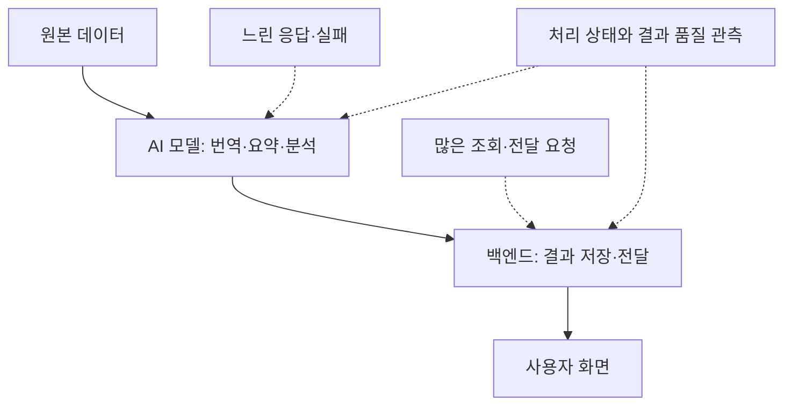
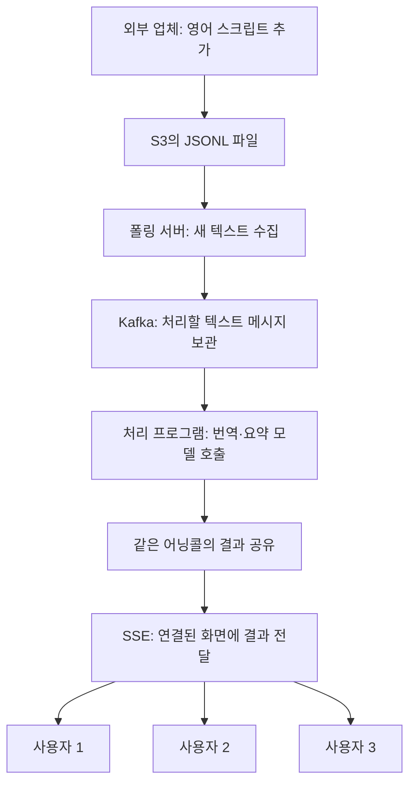
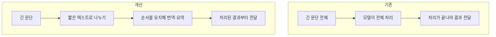
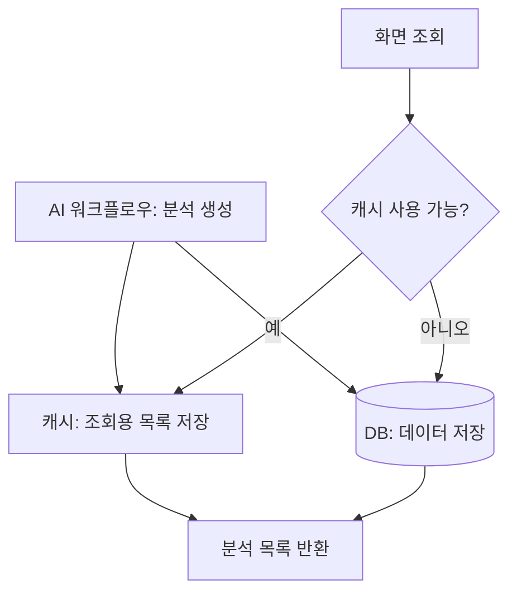
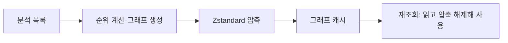
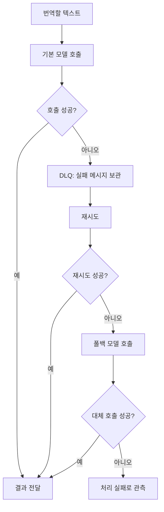
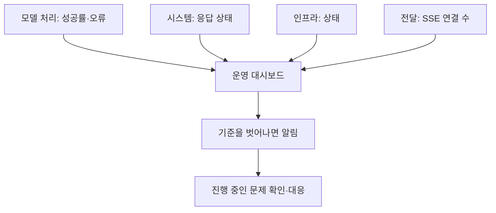
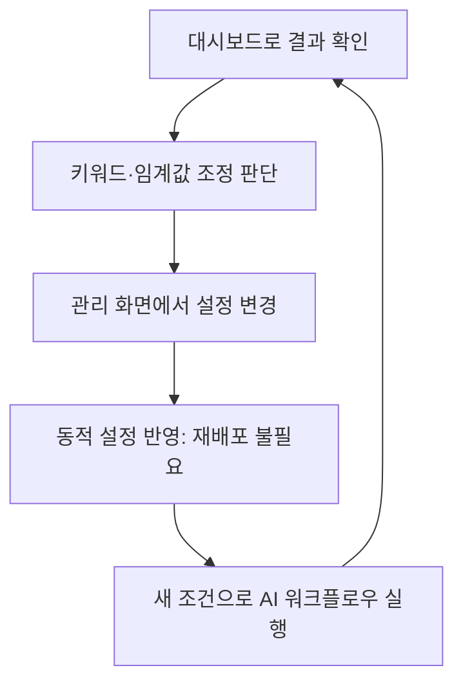
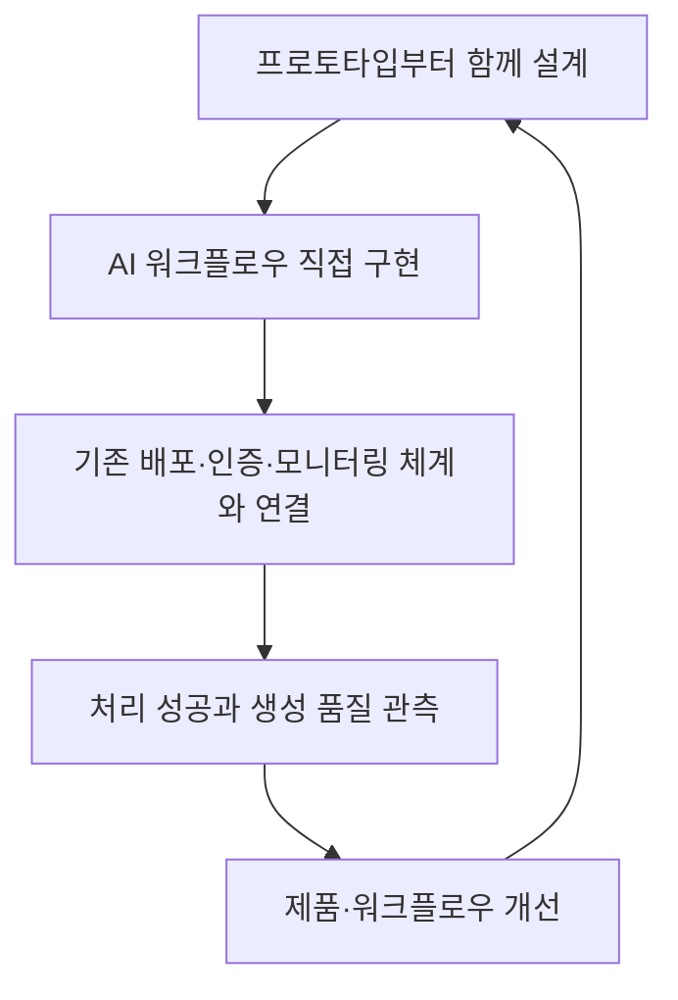

# 토스증권 AI 서비스를 지탱하는 백엔드 엔지니어링 정리

출처: [토스증권 AI 서비스를 지탱하는 백엔드 엔지니어링](https://www.youtube.com/watch?v=lfyKfUFf-sk)

## 1. 핵심 요약

AI 서비스를 만든다고 모델 호출만 잘하면 되는 것은 아니다.
응답이 늦거나 실패해도 서비스를 이어가야 하고, 사용자가 늘어날 때
비용과 DB 부하를 감당해야 한다. 모델이 답을 만들었더라도
그 답이 사용자에게 전달되고 실제로 쓸 만한지도 확인해야 한다.

발표는 두 제품에서 겪은 문제를 설명한다.

- **어닝콜:** 해외 기업의 실적 발표를 실시간으로 번역하고 요약한다.
- **AI 시그널:** AI가 생성한 분석 내용을 순위와 연관 종목 그래프로 제공한다.

해결에 사용한 것은 이벤트 스트리밍, 캐시, 압축, 실패 재시도,
모니터링, 동적 설정처럼 기존 백엔드에서도 사용하던 방법들이다.

## 2. AI를 사용하면 무엇이 달라지나?

| 특성 | 쉽게 말하면 | 백엔드에서 필요한 대응 |
| --- | --- | --- |
| 비결정성 | 같은 질문에도 답이 달라질 수 있다. | 결과가 특정 문자열과 같은지만 검사해서는 부족하다. |
| 긴 응답 시간 | 일부 모델 호출은 몇 초씩 걸린다. | 사용자가 기다리는 시간과 타임아웃을 설계한다. |
| 내용상의 실패 | 요청은 성공했지만 답이 틀릴 수 있다. | HTTP 성공 여부와 답의 품질을 구분한다. |
| 사용량에 따른 비용 | 모델을 많이 호출할수록 비용이 늘어난다. | 같은 결과가 필요한 요청을 모으고 결과를 재사용한다. |
| 품질 기준의 어려움 | 좋은 번역이나 요약을 숫자 하나로 판단하기 어렵다. | 서비스에 맞는 품질 평가 기준을 만든다. |

**예시:** 번역 API가 정상 응답을 반환했어도 “매출 증가”를 “매출 감소”로
번역했다면 사용자 입장에서는 실패다. 서버가 살아 있는지만 확인해서는
이 문제를 발견할 수 없다.

발표에서는 문제를 크게 세 방향으로 나눴다.

- **효율성:** 기다리는 시간과 자원·비용을 줄인다.
- **신뢰성:** 실패해도 복구할 수 있게 한다.
- **유지보수성:** 운영 상태를 확인하고 조건을 바꿀 수 있게 한다.

## 3. 어닝콜: 같은 번역을 사용자마다 만들지 않는다

### 왜 이런 구조가 필요한가?

외부 업체가 어닝콜의 오디오와 영어 스크립트를 제공했다.
스크립트는 S3에 있는 JSONL 파일에 계속 추가되는 형태였다.
JSONL은 한 줄마다 JSON 데이터 하나를 담는 파일 형식이다.

서버는 파일을 주기적으로 확인해 새로 추가된 내용을 가져온다.
이렇게 주기적으로 확인하는 것을 **폴링**이라고 한다.
새 텍스트를 번역·요약한 뒤 시청 중인 사용자들에게 전달한다.

**핵심은 같은 어닝콜의 번역을 사용자마다 따로 생성하지 않는 것이다.**
예를 들어 같은 문장을 100명이 보고 있다면 번역을 100번 하는 대신,
한 번 만든 결과를 100명에게 보내면 된다. 이는 전체 어닝콜에 모델을
딱 한 번 호출한다는 뜻이 아니라, 새 텍스트의 처리 결과를 공유한다는 뜻이다.

### 전체 전달 흐름

- **Kafka:** 처리할 메시지를 보관하고 처리 프로그램이 읽게 한다.
  Kafka 자체가 번역을 하는 것은 아니다.
- **처리 프로그램:** 메시지를 읽고 모델에 번역·요약을 요청한다.
- **SSE:** 서버가 연결된 클라이언트에 새 결과를 계속 보내는 방식이다.
  화면이 번역 결과를 받으려고 매번 다시 요청할 필요를 줄인다.

발표에서는 어닝콜별 추론 경로를 단일화해 비용을 줄이고,
모델 처리 이후의 전달 지연을 줄이는 것을 목표로 했다.

## 4. 어닝콜: 긴 문단을 나누어 기다리는 시간을 줄인다

### 문제

업체의 스크립트는 문장보다 큰 문단 단위로 들어왔다.
긴 문단을 통째로 모델에 보내면 처리해야 할 텍스트가 많아서
사용자가 번역 결과를 오래 기다렸다.

### 해결

폴링 서버에 문단을 더 짧게 나누는 컴포넌트를 추가했다.
나눈 텍스트의 순서를 유지해서 모델에 전달했다.

**예시:** 10문장짜리 문단을 한 번에 처리하는 대신 짧은 묶음으로 나누면,
첫 묶음의 번역부터 사용자에게 전달할 수 있다.
실제 분할 크기와 기준은 자막에 설명되어 있지 않다.

## 5. AI 시그널: 이미 만든 데이터를 재사용한다

### 무엇을 조회하는 화면인가?

AI가 생성한 분석 항목을 대상으로 순위를 정해 상위 30개를 보여주고,
연관 종목을 그래프로 제공하는 화면이다.
발표에서는 순위 계산 대상이 최대 2,000개이고,
해당 화면의 트래픽이 최대 2,000 TPS였다고 설명한다.
TPS는 초당 처리하는 요청 수를 뜻한다.

여기에는 **두 가지 반복 작업**이 있었다.

1. 요청마다 분석 목록을 DB에서 읽으면 DB 부하가 커진다.
2. 순위를 적용해 그래프를 매번 만들면 CPU를 많이 사용한다.

### 해결 1: 분석 목록은 캐시에서 먼저 읽는다

AI 워크플로우가 분석 데이터를 만들 때 DB와 캐시에 모두 저장한다.
일반 조회는 캐시를 사용하고, 캐시를 사용할 수 없으면 DB에서 읽는다.
이처럼 대체 경로를 사용하는 것을 **폴백**이라고 한다.

**예시:** 같은 분석 목록을 100명이 조회해도 매번 DB에서 읽지 않고,
캐시에 저장된 목록을 재사용한다.
DB와 캐시에 모두 저장한다고 두 저장이 하나의 트랜잭션이 되는 것은 아니다.
두 저장소의 불일치 처리 방식은 발표 자막에서 확인되지 않는다.

### 해결 2: 그래프도 캐시하고 압축한다

분석 목록으로 순위와 그래프를 만드는 데도 CPU가 필요하다.
그래서 만든 그래프를 캐시에 저장해 재조회 때 재사용했다.
그래프와 생성 텍스트가 함께 들어 있어 크기가 커지는 문제는
Zstandard 압축으로 줄였다.

**예시:** 같은 그래프를 다시 요청하면 처음부터 계산하지 않고,
저장된 압축 데이터를 읽고 풀어서 사용한다.
압축은 데이터 크기를 줄이는 방법이며, 실제 압축률은 자막에 제시되지 않았다.

## 6. 어닝콜: 모델 호출이 실패하면 다시 시도한다

### 문제

여러 어닝콜이 동시에 열리면서 모델 호출 부하가 커졌고,
번역·요약이 제한 시간 안에 끝나지 않는 타임아웃이 발생했다.
실시간 서비스에서 일부 문단의 번역이 빠지면 사용자가 내용을 놓칠 수 있다.

### 해결: DLQ 재시도와 폴백 모델

먼저 실패한 메시지를 **DLQ**에 보내 다시 처리한다.
DLQ는 실패한 메시지를 따로 모아두는 큐다.
재시도도 실패하면 대체 모델로 처리하도록 했다.
발표에서는 비슷한 품질을 제공할 수 있는 폴백 모델을 준비했다고 설명한다.

**예시:** 문단 3의 번역이 타임아웃으로 실패하면 문단 3을 버리지 않고
재시도 대상으로 남긴다. 재시도도 안 되면 다른 모델로 번역을 요청한다.

재시도 횟수, 대기 시간, 늦게 도착한 결과의 정렬 방식 등은
이 다이어그램에서 생략했다. 자막에는 구체적인 정책이 설명되어 있지 않다.

## 7. 운영: 서버뿐 아니라 실제 처리와 전달을 확인한다

서버가 정상이어도 번역이 실패하거나 사용자 연결이 끊겼다면
사용자는 결과를 받지 못한다. 따라서 서버 상태만 봐서는 부족하다.

발표에서는 다음을 볼 수 있는 대시보드와 알림을 만들었다.

- 번역·요약·분석 등의 추론 성공률
- 시스템 응답 상태
- 인프라 상태
- 오류 종류와 실패 알림
- 사용자에게 전달하는 SSE 연결 수

**예시:** 모델 호출 성공률이 높아도 SSE 연결이 끊겼다면
번역은 만들었지만 사용자는 받지 못했을 수 있다.
처리와 전달을 함께 확인해야 한다.

다만 **호출 성공률이 높다고 번역이나 분석의 내용까지 좋다는 뜻은 아니다.**
“오류 없이 답을 만들었는가”와 “좋은 답을 만들었는가”는 별도로 봐야 한다.

## 8. 운영: 조건을 바꿀 때마다 배포하지 않는다

AI 시그널에는 어떤 뉴스를 후보로 볼지 판단하는 키워드나 임계값이 있다.
이 조건들은 처음부터 정답을 알기 어렵고, 운영 결과를 보면서 조정해야 한다.

조건을 코드에 고정하면 값을 바꿀 때마다 배포가 필요하다.
발표에서는 장중 배포가 자유롭지 않아 필요한 시점에 조정하기 어려웠다고 한다.

그래서 조건을 **동적 설정(Dynamic Config)**으로 분리했다.
관리 화면에서 설정을 바꾸면 재배포 없이 반영되도록 했다.

**예시:** 특정 키워드의 뉴스가 너무 많이 후보로 잡힌다면,
관리 화면에서 키워드 목록을 바꾸고 결과가 개선됐는지 관측한다.
이 예시는 이해를 위한 상황이며 실제 조건값은 아니다.

## 9. 백엔드 엔지니어의 역할도 바뀐다

앞의 방법들로 제품을 안정화해도, 제품을 만드는 과정의 병목은 남았다.
AI 워크플로우와 데이터 수집·정제까지 일이 늘었고,
여러 직군과 기술 스택 사이에서 협업해야 했기 때문이다.

발표에서는 역할을 직무 이름보다 일하는 방식으로 바라보는 관점을 소개한다.
이미 해온 일과 앞으로 강화할 일을 다음처럼 연결했다.

| 일하는 방식 | 발표에서 연결한 활동 |
| --- | --- |
| Builder | 이벤트 구조를 만들고 실패 복구를 설계한다. |
| Sweeper | 문단 분할과 압축 등으로 비효율을 줄인다. |
| Maintainer | 대시보드와 동적 설정으로 운영을 개선한다. |
| Prototyper | 아이디어를 직접 동작하는 시제품으로 만든다. |
| Grower | AI 워크플로우를 반복 개선해 제품 적합성을 높인다. |

마지막 두 역할은 발표 시점에 충분히 수행하고 있다고 보기 어려워,
앞으로 강화하려는 영역이라고 설명했다.

### 실제로 바꾸고 있는 세 가지

1. **서버 엔지니어가 AI 애플리케이션도 직접 개발한다.**
   모델 성능 자체를 개선하는 일과 구분해, 프롬프트 조합·도구 연결·흐름 제어는
   직접 맡으려 한다. Python, LangChain, LangGraph 등을 학습·적용하고,
   기존 배포·모니터링·인증 체계에 연결할 공통 도구도 준비한다.
2. **프로토타입 단계부터 참여한다.**
   워크플로우가 완성된 뒤 전달만 맡으면 지연을 줄일 설계 선택지가 좁다.
   초기부터 참여하면 문단 분할 같은 개선도 처음부터 고려할 수 있다.
3. **생성된 내용의 품질도 관측한다.**
   Langfuse로 추론 과정을 추적하고 품질 지표를 개선 과정에 연결하려 한다.
   발표 시점에는 준비 중이며, 해결을 완료한 사례로 소개한 것은 아니다.

