# 토스증권 통합원장 개발기 정리

출처: [토스증권 김영상의 통합원장 개발기 발표](https://www.youtube.com/watch?v=CU4OTU03EXI)

## 1. 핵심 요약

토스증권은 국내 주식, 미국 주식, 옵션, 채권의 원장을 각각 운영했다.
상품별 독립성은 유지할 수 있었지만, 하나의 계좌 화면을 그리려면
네 시스템의 데이터를 조회하고 합쳐야 했다.

이를 해결하기 위해 **각 원장은 거래를 처리하고, 통합원장은 조회를
담당하는 구조**를 만들었다. 원장이 공통 스키마로 이벤트를 발행하면
통합원장이 이를 적재해 화면과 다른 서비스에 제공한다.

여기서 통합원장은 기존 원장을 합친 거래 시스템이 아니라,
여러 원장의 데이터를 모은 **조회 모델**이다.

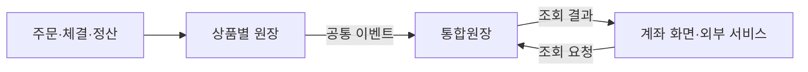

## 2. 용어


| 용어     | 의미                                       |
| ------ | ---------------------------------------- |
| 원장     | 보유 수량, 현금, 매매 내역 등 거래의 기준 데이터를 관리하는 시스템  |
| 통합원장   | 여러 상품의 원장 데이터를 공통 모델로 모아 조회에 제공하는 시스템    |
| CQRS   | 명령을 처리하는 쓰기 모델과 조회 모델을 분리하는 구조           |
| CDC    | DB 변경 로그를 캡처해 다른 시스템으로 전달하는 방식           |
| Outbox | 업무 데이터와 발행할 메시지를 같은 DB 트랜잭션에 기록하는 패턴     |
| 백필     | 기존에 쌓인 과거 데이터를 채워 넣는 작업                  |
| 샤딩     | 데이터를 여러 DB로 나누어 저장하는 방식                  |
| Vitess | 여러 MySQL 샤드의 라우팅과 운영을 지원하는 계층            |
| 섀도잉    | 새 경로의 결과를 비교하되 고객 응답에는 기존 경로를 사용하는 검증 방식 |


## 3. 왜 데이터를 모았나?

### 상품별 원장이 나뉜 배경

- 상품이 서로 다른 시기에 출시되어 기존 상품에 영향을 주지 않아야 했다.
  - ex) 국내 주식이 먼저 출시되고 이후에 미국 주식이 출시 되었다 등..
- 국내 주식의 정산, 미국 주식의 현지 브로커 연동, 옵션의 만기,
채권의 이자처럼 상품별 규칙이 달랐다.
- 상품마다 담당 조직이 달라 시스템도 독립적으로 운영했다.

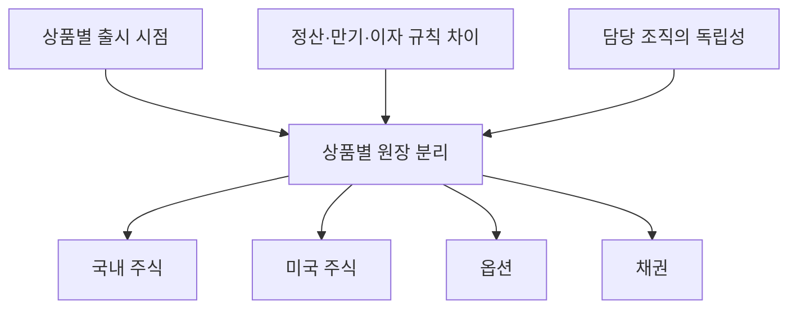

### 문제 1: 조회가 거래 시스템에 부하를 준다

장 시작 시점에는 주문뿐 아니라 잔고와 주문 내역 조회도 함께 몰린다.
조회 트래픽이 원장 DB에 집중되면 반드시 제때 처리해야 하는
주문·체결·정산까지 영향을 받을 수 있다.

따라서 조회 트래픽을 별도로 확장할 수 있는 저장소로 옮겨야 했다.
원장에는 매매 처리와 매매에 직접 필요한 조회를 남긴다.

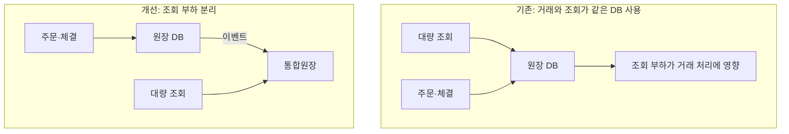

### 문제 2: 소비처마다 통합 로직을 반복한다

계좌 화면, 커뮤니티, 이상 거래 탐지(FDS), 분석, 오픈 API 등이
각자 네 원장에 연결하면 통화, 식별자, 필드 이름을 매번 해석해야 한다.
상품이 추가될 때마다 여러 소비처가 함께 수정되어야 하고,
같은 데이터도 소비처에 따라 다르게 계산될 수 있다.

발표는 연결 관계를 다음과 같이 설명한다.

- 기존: 소비처 N개 × 원장 4개 → `N × 4`
- 통합 후: 원장 4개 → 통합원장 → 소비처 N개 → `N + 4`

이 수식은 연결 관계를 단순화한 설명이며 실제 시스템 복잡도의 측정값은 아니다.

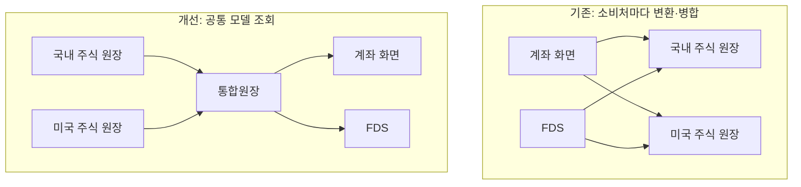

**예시: 국내·미국 주문을 합쳐서 최신 4개 보여주기**

오늘 국내 주식을 4번, 미국 주식을 2번 주문했다고 하자.

- 국내 주문: **오후 6시, 5시, 4시, 3시**
- 미국 주문: **오후 2시, 1시**

화면에 최신 주문 4개를 보여주려면 정답은 **6시, 5시, 4시, 3시**다.
전부 국내 주문이어도 된다. 중요한 것은 상품 종류가 아니라 주문 시간이다.

그런데 국내와 미국 원장에서 최신 주문을 **2개씩** 가져오면 어떻게 될까?

- 국내에서 가져온 것: 6시, 5시
- 미국에서 가져온 것: 2시, 1시
- 합친 결과: **6시, 5시, 2시, 1시** → 최신 4개가 아니다.

국내의 4시, 3시 주문을 아직 가져오지 않았기 때문이다.
제대로 보여주려면 국내 주문을 더 읽어서 미국 주문과 비교해야 한다.
다음 화면에서도 이어서 읽으려면 국내와 미국에서 각각 어디까지
읽었는지 기억해야 한다. 이 위치를 관리하는 값이 **커서**다.

반면 모든 주문을 공통 테이블에 모아두면 DB에
**“상품 구분 없이 최신 주문 4개를 줘”**라고 한 번에 요청할 수 있다.
DB가 전체 주문을 시간순으로 정렬해 6시, 5시, 4시, 3시를 반환한다.

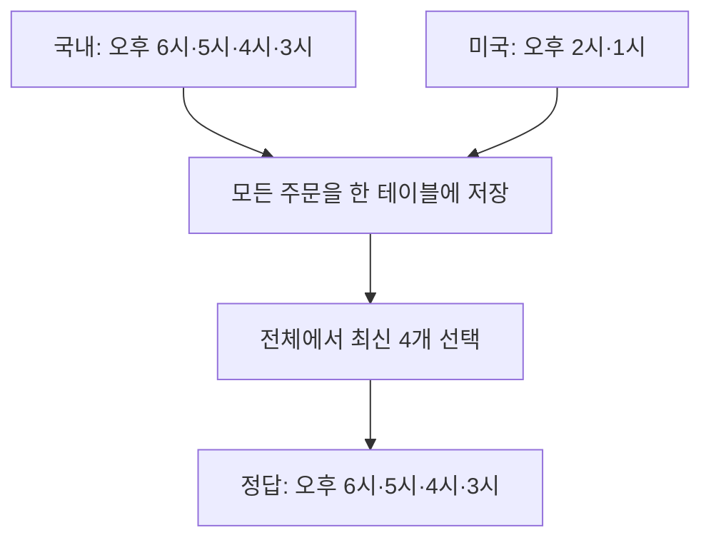

## 4. 어떻게 통합했나?

### 대안과 선택

원장 DB 네 개는 그대로 유지한다. 통합원장을 만들려면 먼저
**여러 원장의 데이터를 어떻게 가져올지** 정해야 한다.
발표에서는 아래 세 방법을 비교했고, 세 번째 방법을 선택했다.

| 방식 | 선택 여부 | 하는 일 |
| --- | --- | --- |
| API 집계 서버 | 선택하지 않음 | 고객이 조회할 때마다 각 원장 API를 호출해 결과를 합친다. |
| 원장 테이블 CDC | 선택하지 않음 | 원장 DB의 변경 기록을 읽어 통합원장 DB에 반영한다. |
| 원장의 공통 이벤트 발행 | 선택함 | 각 원장이 데이터를 공통 형식으로 만들어 보내면 통합원장 DB에 저장한다. |

#### 방법 1: API 집계 서버 — 원장 조회 부하가 남아서 선택하지 않음

집계 서버는 여러 원장에 대신 물어보는 서버다.
고객이 잔고를 조회하면 국내·미국 등의 원장 API를 호출하고,
응답을 합쳐 고객에게 돌려준다.

고객이 100번 조회하면 집계 서버도 각 원장에 100번씩 요청한다.
**중간 서버를 추가해도 원장 DB는 계속 조회에 응답해야 한다.**
따라서 원장의 조회 부담을 줄이려는 목표를 해결하지 못한다.

또한 데이터가 따로 저장되어 있으므로 전체 주문을 시간순으로 보여주려면
집계 서버가 직접 합쳐야 한다. 원장마다 다른 필드 이름과 금액 형식도
이 서버에서 맞춰야 한다. 상품이 늘어나면 이런 처리 코드도 늘어난다.

#### 방법 2: 원장 테이블 CDC — DB 동기화를 위해 검토했지만 선택하지 않음

CDC는 **DB의 변경 기록을 읽어 다른 시스템에 전달하는 기술**이다.
이 방법의 목적은 각 원장 DB의 변경을 통합원장 DB에도 반영하는 것이다.

예를 들어 원장에서 보유 수량이 2주에서 3주로 바뀌면,
CDC가 그 변경을 읽어 전달하고 통합원장도 3주로 갱신한다.
이렇게 하면 고객은 별도 DB인 통합원장을 조회할 수 있으므로
기존 원장의 조회 부담을 줄일 수 있다.

원장과 통합원장을 코드에서 각각 수정하는 방법도 가능하다.
다만 원장 수정은 성공하고 통합원장 수정은 실패할 수 있다.
CDC는 원장에 남은 변경 기록을 바탕으로 변경을 전달하는 방법이다.
실패 후 따라잡으려면 기록 보관과 재시도 설정도 필요하다.

**하지만 CDC로 변경을 가져오는 것만으로 데이터 형식까지 같아지지는 않는다.**
예를 들어 국내 원장은 `보유수량`, 미국 원장은 `quantity`라는 필드를 쓴다면,
통합원장 쪽에서 두 필드가 같은 의미임을 알고 맞춰야 한다.
원장의 필드 구조나 값의 의미가 바뀌면 그 처리도 수정해야 한다.

토스증권은 이런 해석 책임을 통합원장에 두고 싶지 않았기 때문에,
원장 테이블 CDC를 통합 방식으로 선택하지 않았다.

#### 방법 3: 공통 이벤트 — 데이터를 잘 아는 원장이 같은 형식으로 보내도록 선택

각 원장이 내부 데이터를 해석하고 **약속한 공통 형식**으로 만들어 보낸다.
예를 들어 국내 원장과 미국 원장 모두 보유 수량을 `quantity`로 보내면,
통합원장은 각 원장의 내부 필드 이름을 몰라도 데이터를 저장할 수 있다.

원장은 데이터 변경과 정정 시 이벤트를 발행하고,
통합원장은 받은 데이터를 별도 DB에 저장해 조회를 제공한다.
즉, **원장이 데이터의 의미를 책임지고 통합원장은 조회를 담당**한다.

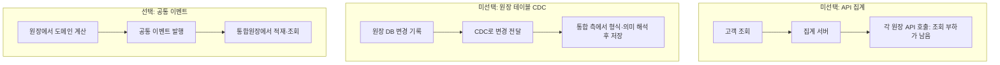

### 이벤트 설계 원칙

통합 대상은 잔고, 주문·체결 내역, 입출금 거래 내역이다.

- 모든 상품과 계좌를 담을 수 있는 공통 인터페이스를 정의한다.
- 환산 등 도메인 계산은 원장에서 수행하고 조회에 필요한 결과를 전달한다.
- 공통 조회 수요가 있는 필드 위주로 구성한다.
- 원장 데이터가 정정되면 해당 원장이 다시 이벤트를 발행한다.

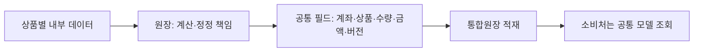

**잔고 이벤트 예시**

```json
{
  "accountId": "A100",
  "productType": "US_STOCK",
  "instrumentCode": "AAPL",
  "quantity": "3",
  "purchaseAmount": "600.00",
  "currency": "USD",
  "version": 12
}
```

소비처는 미국 주식 원장의 내부 테이블을 해석하지 않고,
공통 필드로 보유 종목과 수량을 조회한다.

### 전체 구조

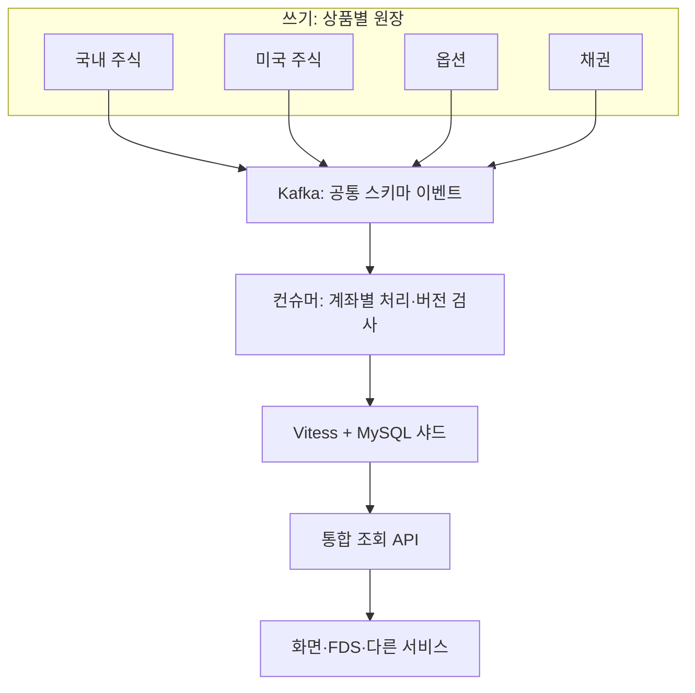

쓰기 시스템 네 개와 읽기 시스템 하나를 분리한 CQRS의 변형으로 볼 수 있다.
비동기로 데이터를 전달하므로 원장 변경이 조회에 반영되기까지 지연이 있다.
발표에서 초기 반영 목표는 1~3초였으며, 실제로는 그보다 짧아졌다고 설명한다.

## 5. 저장소: MySQL + Vitess

선정 기준은 수평 확장, 계좌 외 조건으로 조회 가능 여부,
트랜잭션 안전성, 장애를 다룰 수 있는 운영 경험이었다.


| 후보             | 프로젝트에서의 판단                                         |
| -------------- | -------------------------------------------------- |
| Cassandra      | 쓰기 처리에는 적합하지만 계좌 외 조건으로 역방향 조회하는 요구에 어려움이 있었다.     |
| MongoDB        | 평면 레코드 중심 데이터에 문서 모델의 이점이 크지 않았고, 필요한 운영 경험도 부족했다. |
| MySQL + Vitess | 기존 MySQL 운영 경험을 활용하면서 샤딩을 도입할 수 있었다.               |

쉽게 말하면 후보별 판단은 다음과 같다. 이 프로젝트의 요구와 운영 경험을
기준으로 비교한 것이며, 각 DB의 일반적인 우열을 뜻하지 않는다.

- **Cassandra:** 많은 데이터를 쓰는 데 적합하다. 하지만 계좌별로 저장하면
  “철수가 가진 주식”을 찾는 것과 달리 “삼성전자를 가진 모든 계좌”를 찾으려면
  별도 조회용 테이블 등을 설계해야 한다. 이런 조회 요구가 선택에 걸림돌이었다.
- **MongoDB:** 한 문서 안에 여러 정보를 중첩해 담을 수 있다. 그런데 여기서는
  계좌·종목·수량처럼 단순한 행 형태의 데이터가 중심이라 문서 구조의 이점이
  크지 않았다. 팀이 중요한 시스템에서 MongoDB를 운영한 경험도 부족했다.
- **MySQL + Vitess:** 익숙한 MySQL을 계속 쓰면서 데이터를 여러 DB로 나눌 수
  있었다. 예를 들어 일부 계좌는 DB 1, 다른 계좌는 DB 2에 저장하고,
  Vitess가 요청을 해당 DB로 보내준다. 이 조합을 선택했다.

### Vitess는 무엇인가?

**여러 MySQL DB를 묶어서 사용하도록 돕는 도구**다.
데이터가 많아져 MySQL 한 대로 감당하기 어려워지면 여러 DB에 나누어
저장한다. 이를 샤딩이라고 한다.

애플리케이션이 “A100 계좌를 조회해 줘”라고 요청하면,
Vitess가 그 계좌가 저장된 MySQL로 요청을 보낸다.
애플리케이션 코드가 요청마다 대상 DB를 직접 고르는 부담을 줄여준다.
Vitess 자체에 데이터를 저장하는 것이 아니라, 실제 저장은 MySQL이 한다.


애플리케이션은 VTGate에 쿼리를 보내고, VTGate는 샤드 키에 따라
대상 샤드로 라우팅한다. 각 MySQL에는 VTTablet이 붙어 쿼리 처리와
관리를 지원한다. 실제 데이터는 MySQL에 저장된다.

데이터를 여러 MySQL DB에 나누어 저장할 때 **계좌번호**를 기준으로 삼았다.
이 기준을 샤드 키라고 한다. 같은 계좌의 데이터를 같은 샤드에 모으면,
특정 계좌의 잔고와 주문 내역을 조회하기 편하다.

**예시:** A100 계좌의 잔고와 주문 내역을 같은 계좌 기준으로 배치하면,
주요 계좌 조회에서 여러 샤드로 흩어진 데이터를 모으는 부담을 줄일 수 있다.
반면 전체 계좌에서 특정 종목을 찾는 조회는 여러 샤드를 조회할 수 있으므로,
계좌 기준 조회와 같은 비용으로 처리된다고 보장할 수는 없다.

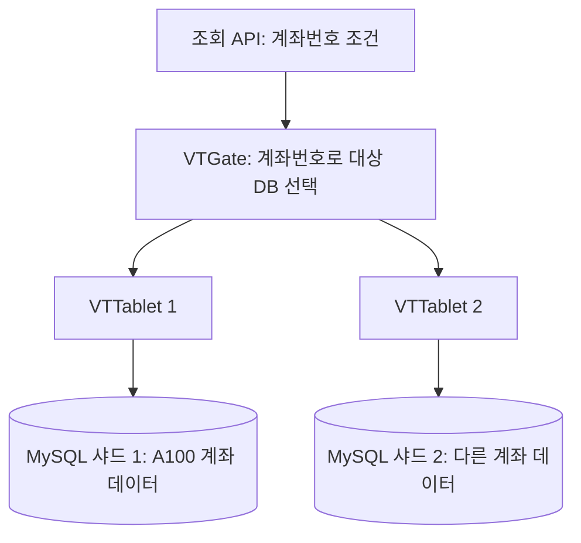

### 리샤딩 절차

1. 새 샤드로 초기 데이터를 복사하고, 이후 변경을 스트리밍으로 따라잡는다.
2. VDiff로 기존 샤드와 새 샤드의 데이터를 비교한다.
3. 검증 후 SwitchTraffic으로 전환한다. 문제가 생기면 되돌린다.
4. 확인이 끝나면 기존 샤드를 정리한다.

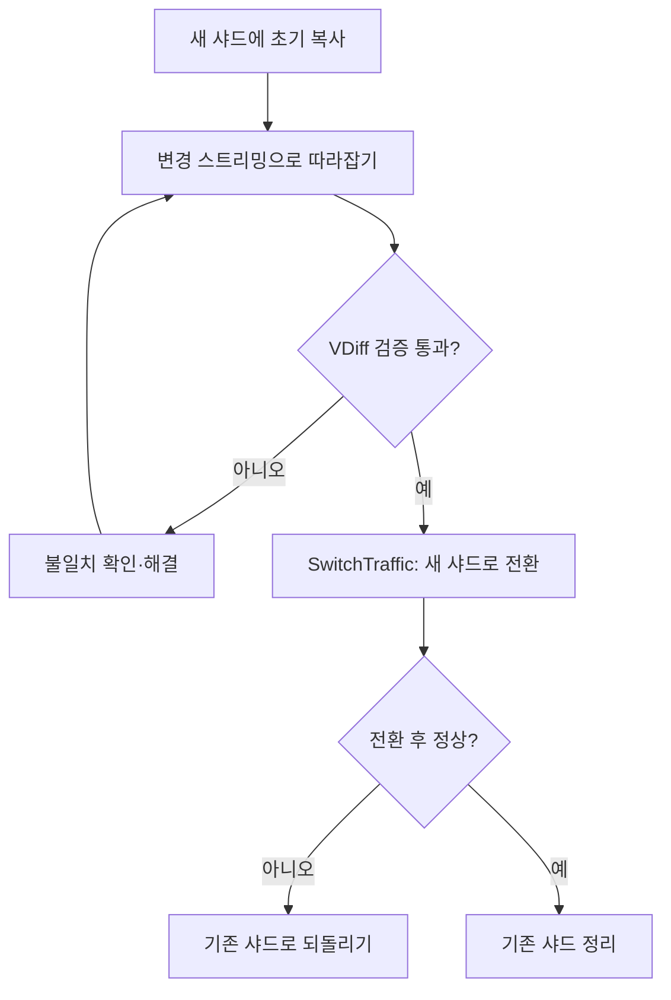

## 6. 복제 과정에서 해결한 문제

### 6.1 순서 역전: 계좌별 처리 + 버전 비교

Kafka는 같은 파티션에 기록된 순서를 보장한다.
하지만 재발행이나 백필로 오래된 상태가 나중에 들어오는 것까지 막지는 못한다.

- 같은 계좌는 순차 처리하고 다른 계좌는 병렬 처리한다.
- 저장된 버전보다 낮은 버전의 이벤트는 버린다.

**예시: 오래된 잔고가 최신 잔고를 덮어쓰는 상황**


| 도착 순서 | 이벤트                   | 처리               |
| ----- | --------------------- | ---------------- |
| 1     | A100 / AAPL / 5주 / v3 | 최신 상태로 저장        |
| 2     | A100 / AAPL / 2주 / v2 | 저장된 v3보다 낮으므로 무시 |


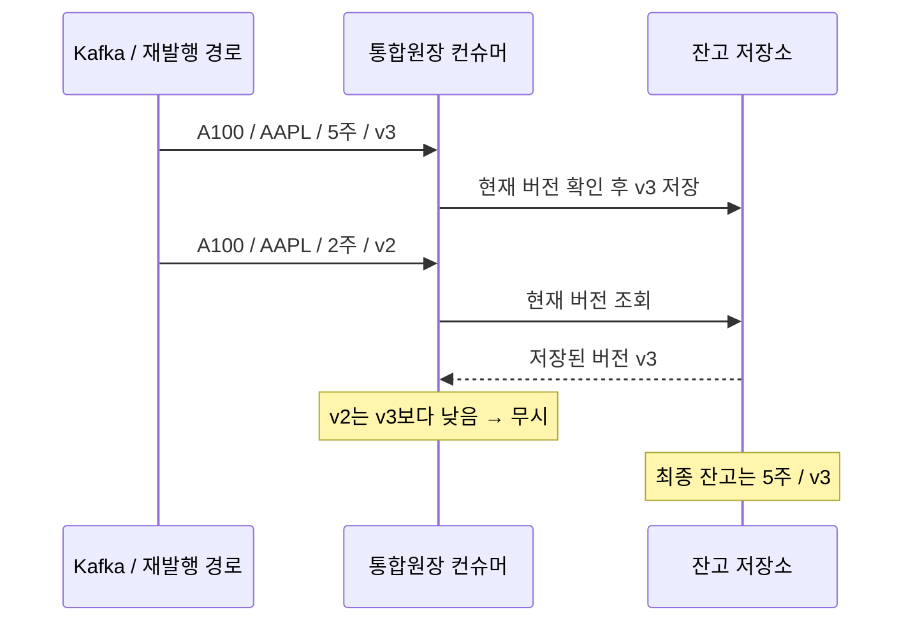

이해를 위한 의사 코드:

```text
현재 상태 = 잔고 조회(이벤트의 계좌, 상품, 종목)
if 현재 상태가 있고 이벤트.version < 현재 상태.version:
  무시
else:
  잔고 갱신
```

이 예시는 보유 수량의 전체 상태를 전달하는 경우다.
`수량 +1` 같은 증분 이벤트는 단순히 오래된 이벤트를 버리면 누락될 수 있다.
같은 버전의 재전달 처리와 비교·갱신의 원자성도 구현에서 고려해야 하지만,
구체적인 방식은 자막만으로 확인되지 않는다.

### 6.2 유실: Outbox + 원본 대조

원장 DB 저장과 Kafka 발행을 별도로 처리하면,
DB에는 반영됐지만 이벤트는 발행되지 않는 상황이 생길 수 있다.

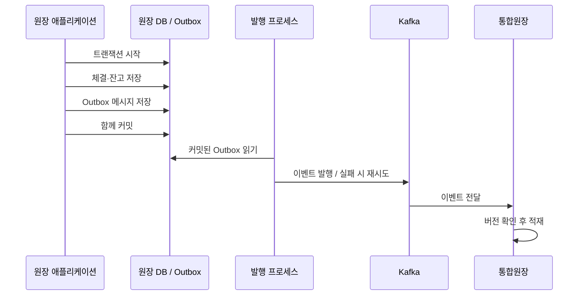

업무 데이터와 메시지 기록이 함께 커밋되므로,
원장에 반영된 변경의 발행 의도를 남기고 재시도할 수 있다.
다만 Outbox만으로 전체 전달 경로의 유실이나 중복까지 해결되지는 않는다.

발표에서는 주기적인 검증 배치로 원장과 통합원장을 비교하고,
불일치가 발견되면 다시 동기화하는 장치도 두었다.

**예시:** 원장에는 5주, 통합원장에는 3주가 저장되어 있다면
검증 배치가 불일치를 탐지한다. 원장의 최신 상태를 다시 동기화하고,
통합원장은 버전을 비교해 반영한다.

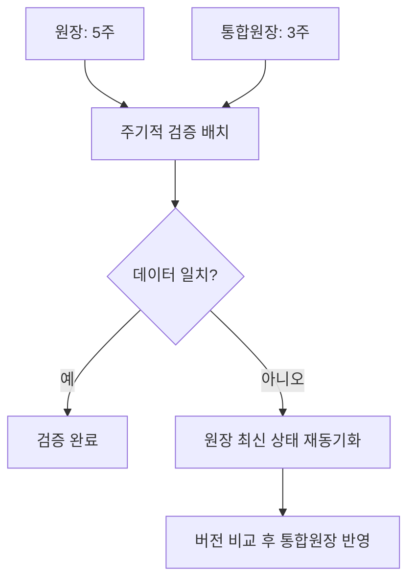

### 6.3 백필 폭증: 실시간 처리와 자원 분리

과거 데이터를 실시간 이벤트와 같은 토픽으로 보내자
컨슈머가 밀리면서 장중 데이터 반영이 지연됐다.

이를 해결하기 위해 실시간 이벤트와 백필·데드레터 처리를
목적에 따라 토픽과 처리 스레드로 분리했다.

**예시:** 과거 주문 100만 건을 복원하는 작업 때문에
방금 체결된 주문까지 대기하지 않도록 처리 경로를 나눈다.
두 경로에서 같은 데이터가 들어올 수 있으므로 버전 비교는 계속 필요하다.

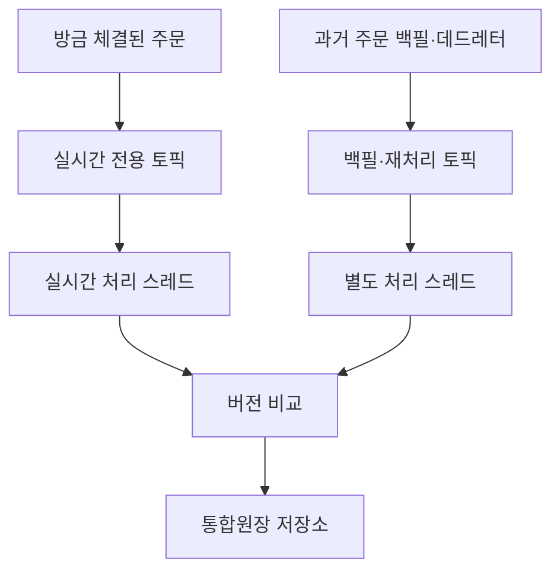

## 7. 기존 조회를 어떻게 전환했나?

1. **듀얼 리드:** 기존 원장과 통합원장을 함께 조회해 결과를 비교한다.
 고객에게는 기존 원장 결과를 제공한다.
2. **점진 전환:** 사내 임직원부터 시작해 고객 1% → 5% → 25% → 100%로
 통합원장 사용 비율을 높인다.
3. **폴백:** 불일치나 이상이 발생하면 설정 스위치로 기존 원장 조회로 돌아간다.

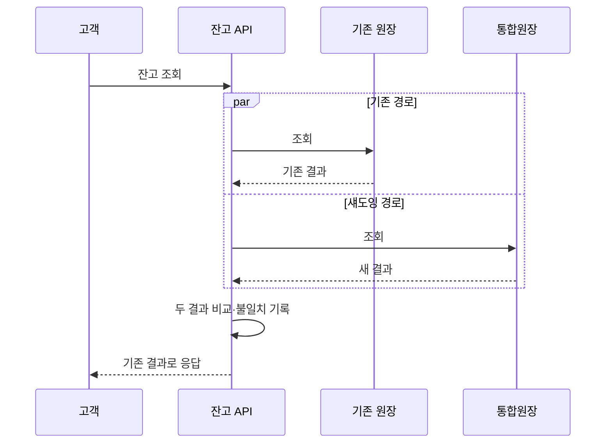

**예시:** 잔고 API가 기존 경로에서는 5주, 새 경로에서는 3주를 반환하면
아직 새 경로를 고객 응답에 사용하지 않고 원인을 확인할 수 있다.
비동기 반영 지연에 따른 일시적 차이와 실제 누락을 구분하는 기준도 필요하다.
이 비교 기준의 세부 구현은 발표 자막에 설명되어 있지 않다.

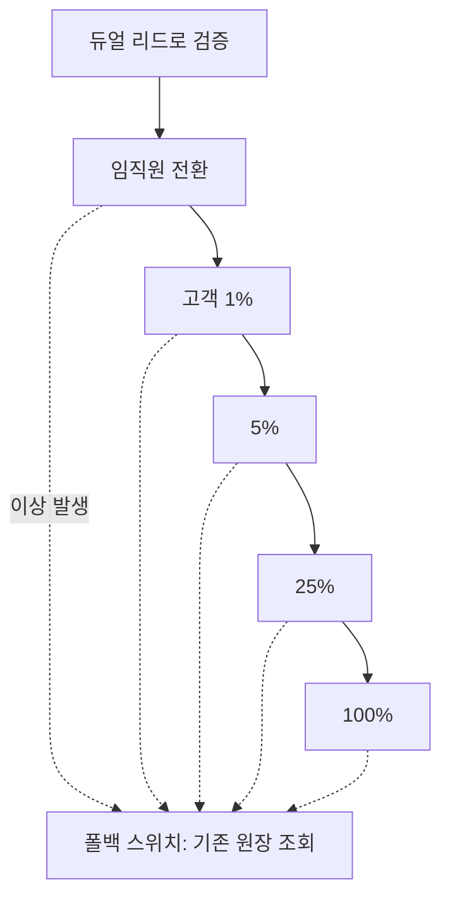

## 8. 결과와 설계에서 배울 점

- 소비처가 네 원장의 데이터를 각각 해석하던 로직을 줄였다.
- 대부분의 조회를 통합원장이 흡수해 원장의 거래 처리 부담을 낮췄다.
- 발표에서는 동시 접속자가 약 3배로 증가한 상황에서도
원장 CPU가 약 60% 감소했다고 설명한다.
이는 발표자가 제시한 운영 결과이며 다른 환경의 성능을 보장하는 수치는 아니다.

이 사례의 핵심은 데이터의 의미를 아는 원장이 공통 계약을 책임지고,
통합원장은 조회와 확장에 집중하도록 역할을 나눈 것이다.
그 구조를 운영하려면 이벤트 발행뿐 아니라 순서 역전 방어,
원본 대조, 백필 격리, 검증 후 전환까지 함께 설계해야 한다.
