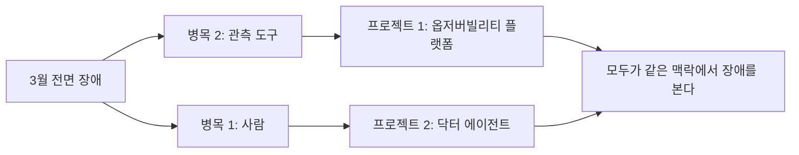
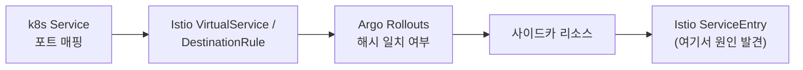
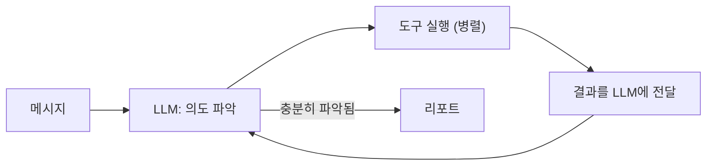
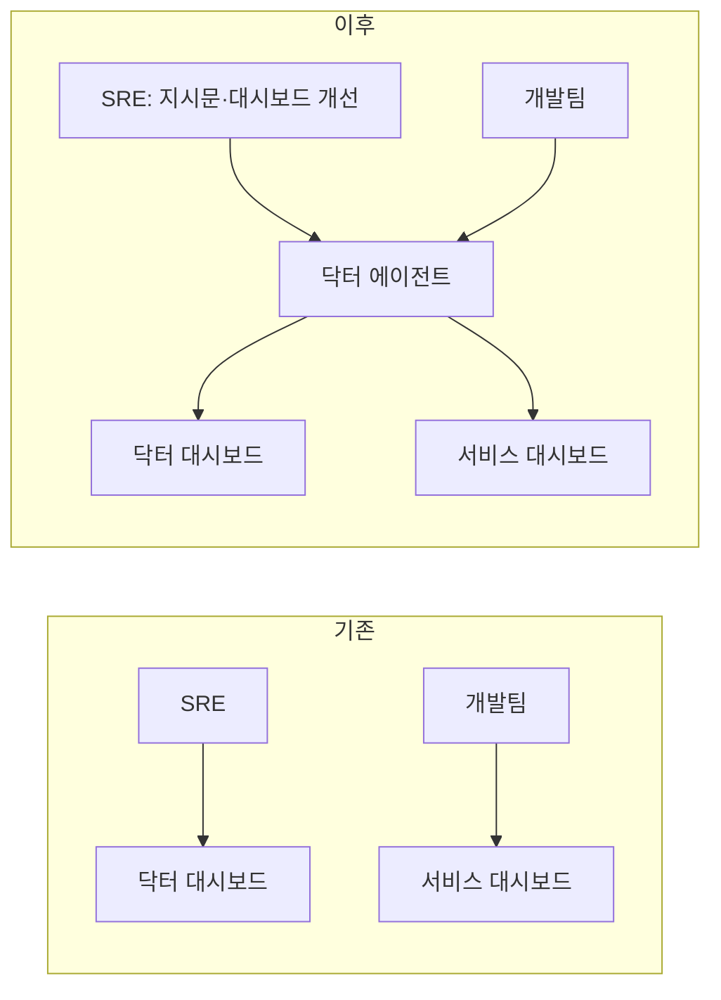

# 당근 SRE의 옵저버빌리티 플랫폼과 닥터 에이전트 정리

출처: 당근 SRE 팀의 옵저버빌리티 플랫폼·닥터 에이전트 발표

## 1. 핵심 요약

3월 전면 장애에서 **사람**과 **관측 도구**가 병목임을 확인했다.
Grafana 대신 자체 웹 옵저버빌리티 플랫폼을 만들어 장애를 보는 방식을 표준화하고,
닥터 에이전트가 얼럿을 받아 1~2분 안에 분석 리포트를 내도록 했다.
원인 추적 40분이 1~2분으로 줄었고, 장애 시 모두가 같은 맥락을 보게 됐다.



## 2. 용어

| 용어 | 의미 |
| --- | --- |
| 닥터 대시보드 | 인프라 컴포넌트별 정상 지표를 모아 둔 SRE 팀의 대시보드 |
| 닥터 에이전트 | 닥터 대시보드·로그·CLI를 병렬로 조회해 분석 리포트를 내는 AI 에이전트 |
| 헬시 마커 | 탭·패널마다 정상/이상 여부를 표시해 어디를 봐야 하는지 알려주는 표시 |
| Envoy NC 플래그 | Envoy 응답 플래그 중 NC(No Cluster found). 매칭되는 업스트림 클러스터가 없을 때 기록된다 |
| ServiceEntry | Istio 메시 외부 서비스를 메시 안에 등록하는 리소스 |
| ReAct | LLM이 추론과 도구 실행을 번갈아 반복하는 에이전트 패턴 |
| MCP | 에이전트가 외부 도구·데이터에 접근하도록 하는 표준 프로토콜 |

## 3. 2026년 3월 장애

| 항목 | 내용 |
| --- | --- |
| 지속 시간 | 약 50분 |
| 영향 | 트래픽 40~50% 감소, 전면 장애로 진행 |
| 원인 구간 | 인증 서비스 쪽 Envoy 라우팅 |
| 근본 원인 | ServiceEntry 자동 관리 컨트롤러의 방어 로직 오류로 잘못된 주소가 ServiceEntry에 유입 |
| 시간 배분 | 원인 추적 약 40분, 해결 약 2분 |

### 대응 과정에서 겪은 일

- 인시던트 채널에 스레드·허들로 사람이 모이고, 얼럿과 에러 로그가 폭주했다.
- "NC 네트워크 플래그가 떨어진 것 같다" 같은 팀 내부 용어가 쏟아져
  맥락 없는 사람은 이해하기 어려웠다.
- Envoy 설정을 최근에 작업한 담당자는 휴가 중이었고, 사무실에는 SRE가 몇 명 없었다.
- 허들 답변, CS 팀 소통, 라우팅 컴포넌트 재시작·재생성 같은 복구 시도를
  동시에 이어갔다.
- 라우팅 관련 컴포넌트를 순차적으로 확인했다.



#### 예시: 장애 당시 Slack 스레드 (발표 내용 재구성)

```text
[15:52] 제레니: 어느 서비스 영향일까요?
[15:55] DB팀: 원인인지 결과인지 모르겠지만 DB 지표 공유합니다 (AWS 콘솔 캡처)
[15:58] SRE A: 인증 서비스 구간에 Envoy NC 네트워크 플래그가 떨어지는 것 같아요
[15:59] 개발자 B: NC가 뭔가요?
[16:01] CS팀: 고객 응대해야 하는데 영향도가 어떻게 되죠?
[16:03] 개발자 C: DB 대시보드 링크 봐 주세요 / Datadog 에러 링크는 뭔가요?
[16:05] 얼럿봇: [CRITICAL] auth-service 5xx 급증 (수십 건 연속)
```

- 장애를 리드하는 입장에서는 "중요한 단서"만 뽑아내고 싶은데,
  질문 답변과 분석을 동시에 해야 했다.

## 4. 회고에서 발견한 두 가지 병목

### 병목 1: 사람

- 담당자 부재, 발표·미팅 등으로 대응 가능 인력이 제한된다.
- SRE 3명이 Envoy 설정을 나눠 보며 논리적 결함을 찾는 데 약 20분이 걸렸다.
- 사람은 순차적으로 본다. 닥터 대시보드 → Loki 로그 → 트레이스
  → kubectl 파드 조회 순으로 보고 머릿속에서 종합한다.
- 장애 인지 → 메트릭·로그 확인 → 스코프 축소 → 원인 추적 → 해결 중
  "조치"보다 "분석" 단계가 훨씬 길었다.
- **방향:** AI 에이전트에게 분석을 위임하고 병렬로 쿼리하게 한다.

#### 예시: 사람의 순차 분석 vs 에이전트의 병렬 분석

```text
사람 (순차, 약 20~40분)
1. 닥터 대시보드 열어서 이상 패널 찾기                  (5분)
2. Loki에서 auth-service 에러 로그 조회                 (5분)
3. Datadog APM에서 트레이스 확인                        (5분)
4. kubectl get pods / describe 로 파드 상태 확인        (5분)
5. istioctl 로 VirtualService, ServiceEntry 확인        (10분)
6. 머릿속에서 종합 → 원인 판단

에이전트 (병렬, 약 1~2분)
1~5 를 동시에 실행
→ 결과를 LLM이 종합 → 의심 영역 특정 → 그 영역만 드릴다운 → 리포트
```

### 병목 2: 관측 도구

- 각자 다른 도구(Grafana, AWS 콘솔, Datadog)의 스크린샷을 공유했다.
- 대시보드 패널의 쿼리가 신뢰할 만한지, 메트릭 해석이 맞는지 사람마다 달랐다.
- 장애 40분 동안 "NC가 뭔가요?", "DB 대시보드 링크 봐 주세요",
  "Datadog 에러 링크는 뭔가요?", "CS 답변용 영향도는?" 같은 질문에
  답하느라 커뮤니케이션 비용이 컸다.
- **방향:** 당근의 장애 트러블슈팅을 표준화한 통합 도구를 만든다.

## 5. 프로젝트 1: 옵저버빌리티 플랫폼

### Grafana에 대한 입장

- 제목은 "걷어낸다"지만 실제로는 걷어내는 방향으로 이동 중이다.
- 여전히 Grafana에 의존하는 부분이 많다.
  전용 모니터링·분석 대시보드, 인프라 작업 가시화, 얼럿 시스템 등이다.
- 표준화된 대시보드가 축적된 것이 중요했다.
  서비스 대시보드, 국가별 모니터링 대시보드, 인프라 컴포넌트 닥터 대시보드가 있다.

### Grafana의 한계

| 한계 | 내용 |
| --- | --- |
| 표현력 | 타임시리즈·파이 차트로 표현할 수 없는 문제가 늘어남 |
| 패널 과다 | 서비스 대시보드 패널 70개 이상, 문제 패널 찾기가 일이 됨 |
| 조건부 노출 불가 | GPU 패널이 필요 없는 팀에도 노출됨, 프로그래밍으로 제어하기 어려움 |
| 얼럿 복잡도 | CPU 70% 얼럿 하나 걸려고 해도 Policy, Contact Point 등 알아야 할 것이 많음 |

- AI 덕에 개발이 쉬워져, 오픈소스·SaaS UI의 한계를 감수하는 대신
  맥락에 맞는 도구를 직접 만들 수 있게 됐다.
- 작년부터 Grafana → 웹 플랫폼 전환을 결정했다.
  얼럿은 자체 얼럿 엔진으로, 뷰는 옵저버빌리티 플랫폼으로 푼다.

### 세 가지 목표

1. 문제 영역을 빠르게 파악하고 드릴다운할 수 있게 한다.
2. 당근 인프라 맥락을 녹인다.
3. 여러 관측 서비스를 추상화한다.

### 목표 1: 스코프를 좁혀가는 UI

| 탭 | 내용 |
| --- | --- |
| 홈 | 서비스 정상 상태, 한국·북미·일본 서비스 지표 |
| 리전 오버뷰 | 국가 레벨 외부·내부 트래픽, Android/iOS 응답 성공률, 느린 요청 비율 |
| 서비스 워크로드 | 워크로드 상세 지표(CPU, 쿠버네티스 등), 조건부 패널(GPU 사용 프로젝트만 GPU 패널 노출) |
| 서비스 맵 | 프로젝트 의존성 그래프, 응답 성공률·레이턴시 기반으로 느린 구간을 엣지로 표시 |
| 익스플로러 | 로그, 트레이스, 이벤트. 개발팀이 플랫폼 안에서 루트 코즈까지 한 사이클 완료 |

#### 예시: 드릴다운 흐름 (가상 시나리오)

```text
홈
  한국 √ / 북미 √ / 일본 ! 응답 성공률 97.2% (평소 99.8%)
  └ 일본 카드 클릭
리전 오버뷰 (일본)
  iOS 응답 성공률 96.1% ! , Android 98.9%
  느린 요청 비율 상위: chat-api, feed-api
  └ chat-api 클릭
서비스 맵
  chat-api → user-profile 엣지가 빨간색 (p99 레이턴시 3.2s)
  └ user-profile 클릭
서비스 워크로드 (user-profile)
  서브탭: [개요 √] [리소스 !] [네트워크 √] [쿠버네티스 √]
  리소스 탭: 메모리 사용률 94%, OOMKilled 재시작 3회
  └ 로그 익스플로러에서 해당 파드 로그 → 루트 코즈
```

- 매 단계마다 헬시 마커가 "어디로 들어가야 하는지" 알려준다.
- Grafana였다면 70개 패널 중 메모리 패널을 사람이 직접 찾아야 했다.

### 목표 2: 인프라 맥락 반영

- 모바일·웹부터 서비스 파드까지 트래픽이 거치는 인프라 경로를
  플랫폼에 녹여 각 컴포넌트의 헬시 여부를 보여준다.
- 개발팀도 내 파드에 트래픽이 어떻게 들어오는지 확인할 수 있다.
- 쿠버네티스 노드 그룹 정보, 내 서비스가 배포된 노드 그룹과 메트릭을
  Grafana 패널보다 자유롭게 표현한다.

### 목표 3: 관측 서비스 통합

- 분산 트레이싱은 Datadog을 쓴다. 기존에는 Grafana → Datadog APM으로
  옮겨 다니며 링크를 공유했다.
- 이제 플랫폼 안에서 트레이스까지 확인해 루트 코즈를 찾는 원플로우를 완성했다.
- eBPF 스캐너(다음 세션 발표자 '택'이 개발)로 시스콜·병목을
  로우 레벨에서 분석할 수 있게 연결했다.

### 해결한 사례

**노드 라이프사이클과 파드 라이프사이클 연결**

- Grafana에서는 타임라인 패널, 변화량 패널을 만들어도
  만든 사람 외에는 해석할 수 없었다.
- 웹에서는 위에 노드 타임라인, 아래에 소속 파드 타임라인을 엮고
  이벤트 배지로 Karpenter 축출 때문인지, 배포 때문인지 표시한다.

**UI 뎁스 문제**

- 서비스 워크로드에 서브탭과 서브탭별 헬시 마커를 두어
  문제 영역으로 빠르게 포커싱하도록 넛지를 넣었다.

**전문가 지식 설명 추가**

- 메트릭 상황과 함께 Envoy 네트워크 플래그(NC 등) 설명을 패널에 넣어
  SRE가 아닌 사람도 맥락을 이해하게 했다.

#### 예시: 노드·파드 라이프사이클 패널 (가상)

```text
node-abc ─────────────────────[Karpenter 축출 16:02]
  pod-1  [배포 15:40]──────────┤
  pod-2  ──────────────────────[축출로 종료 16:02]

node-def                        [신규 노드 16:03]──────
  pod-2'                            [재스케줄 16:04]───
```

- "파드가 왜 죽었지?"에 대한 답이 이벤트 배지로 바로 보인다.
  축출 때문인지, 배포 때문인지 구분된다.

#### 예시: 패널 안의 전문가 설명 (가상)

```text
[Envoy Response Flags] NC ▲ 1,240/min

NC (No Cluster found)
요청이 매칭되는 업스트림 클러스터를 찾지 못했을 때 기록됩니다.
VirtualService, DestinationRule, ServiceEntry 설정 변경 직후
급증하면 라우팅 설정 오류를 의심하세요.
```

- 3월 장애 때 나온 "NC가 뭔가요?" 질문이 이 설명으로 대체된다.

### 결과

- 장애를 바라보는 방식이 표준화되고 맥락 비용이 감소한다는 확신을 얻었다.

## 6. 프로젝트 2: 닥터 에이전트

### 배경: 닥터 대시보드

- SRE 팀의 업무 프레임워크 중 하나로, 인프라 컴포넌트의 정상 지표를 확인한다.
- SRE 개개인이 오너십을 갖고 보강하며 전문성을 쌓았다.
  암묵지를 형식지로 드러내는 역할을 했다.
- 예: Istio 닥터 대시보드. 상단은 istiod 등 세부 컴포넌트 정상 상태,
  우측은 얼럿, 하단은 드릴다운 메트릭으로 구성된다.

### POC

| 항목 | 내용 |
| --- | --- |
| 목표 | 닥터 대시보드를 보고 드릴다운 수행, 3월 장애 상황을 효과적으로 분석 |
| 구현 | Python LangGraph, ReAct 루프 에이전트 |
| 동작 | 메시지 → LLM이 의도 파악 → 도구 실행 → 결과를 LLM에 전달 → 반복 → 리포트 |
| 도구 | Grafana, Prometheus, Loki, kubectl, istioctl 등 사람이 쓰던 CLI 그대로 제공 |
| 분석 순서 | 얼럿, 닥터 대시보드 오버뷰, 로그를 최대한 병렬로 확인 → 문제 영역 특정 → 드릴다운 |
| 결과 | Claude Sonnet으로도 1~2분 안에 의미 있는 리포트 생성 |



#### 예시: ReAct 루프 한 바퀴 (가상)

```text
[Human] istio 닥터 대시보드 확인하고 이상 있으면 원인 분석해줘
[LLM]   오버뷰 행, 얼럿, 최근 로그를 먼저 보겠다
  > tool: grafana_query(dashboard="istio-doctor", row="overview")
  > tool: alert_list(component="istio", since="30m")
  > tool: loki_query('{app="istiod"} |= "error"', since="30m")
  (세 도구 병렬 실행)
[Tool]  overview: ServiceEntry 수 1,203 → 1,204 (+1, 15:49)
        alerts: [HIGH] auth-service NC flag spike (15:50~)
        loki: istiod "validation skipped for ServiceEntry ext-xyz"
[LLM]   15:49 ServiceEntry 추가 직후 NC 급증. 해당 리소스 확인
  > tool: kubectl("get serviceentry ext-xyz -n istio-system -o yaml")
[Tool]  hosts: ["auth.internal.daangn"]  ← 내부 서비스 주소가 외부 엔트리에
[LLM]   충분히 파악됨 → 리포트 작성
[Report]
  요약: 15:49 생성된 ServiceEntry ext-xyz 가 내부 인증 서비스 주소를
        외부로 선언해 auth-service 라우팅이 NC 로 실패 중
  영향: 인증 경유 요청 전체, 트래픽 약 45% 감소
  권장 조치: ext-xyz 삭제 또는 hosts 수정, 컨트롤러 방어 로직 점검
```

- 실제 3월 장애에서 사람이 40분 걸린 경로를 에이전트는 병렬 조회로 압축한다.

### 확장

- 테크스펙 리뷰 후 컴포넌트별 닥터로 확장했다.
- 서비스 대시보드에도 닥터(서비스 닥터)를 추가해 개발팀도 활용한다.
- 얼럿 시스템 연동, Slack 대화형 인터페이스를 추가했다.

### 구조 변화

- **기존:** SRE가 닥터 대시보드를 보고, 개발팀이 서비스 대시보드를 본다.
- **이후:** 사이에 닥터 에이전트가 들어가 객체화된 닥터들이 대시보드를 분석한다.
  SRE는 더 잘 분석하도록 지시문을 다듬고 대시보드를 개선한다.
- 대시보드는 장기적으로 Grafana에서 옵저버빌리티 플랫폼으로 이동한다.



### 얼럿 연동

- 사내 얼럿 딜리버리 시스템은 얼럿을 인프라 얼럿·서비스 얼럿으로 분류하고
  심각도를 측정한다.
- 심각도가 높은 얼럿은 닥터 에이전트가 자동 분석한다.

#### 예시: 얼럿 → 자동 분석 흐름 (가상)

```text
얼럿 딜리버리
  [서비스 얼럿] feed-api 5xx 비율 8% (임계 2%) severity: HIGH
  └ HIGH 이상 → 닥터 에이전트 자동 호출
Slack #incident-feed-api
  └ 닥터 에이전트 (1분 40초 후)
    요약: feed-api 가 의존하는 redis-feed 의 메모리 사용률 98%,
          eviction 급증으로 캐시 미스 → DB 커넥션 풀 고갈 → 5xx
    근거: redis memory used 98% (16:10~), feed-api 로그 "pool exhausted" 3,122건
    영향: 피드 조회 요청 약 8% 실패, 한국 리전 한정
    권장: redis-feed 메모리 증설 또는 TTL 조정, 커넥션 풀 상한 검토
```

### 대화형 활용 사례

- 엔지니어가 얼럿을 받고 Slack에서 닥터 에이전트와 대화하며 문제를 파악한다.
- 사내 코딩 에이전트 '탑'이 닥터 에이전트 분석 결과로 PR을 만들어
  에이전트만으로 이슈를 처리하는 사례가 나타났다.
- 프로덕트 팀의 에이전트가 닥터 에이전트를 호출해 Slack에서 대화하고
  다른 결과물을 재생산하는 형태로 진화 중이다.

#### 예시: 엔지니어 ↔ 닥터 에이전트 대화 (발표 사례 재구성)

```text
엔지니어: 방금 온 chat-api 레이턴시 얼럿, 배포 때문이야?
닥터:     16:20 배포(rollout rev 42) 직후 p99 가 400ms → 2.1s 로 올랐습니다.
          같은 시각 user-profile 호출 수가 요청당 1회 → 12회로 늘었습니다.
          N+1 호출이 생긴 것으로 보입니다.
엔지니어: rev 41 이랑 비교해서 어떤 코드가 바뀐 거야?
닥터:     rev 42 diff 에서 ChatListHandler 가 참여자별로 프로필을 개별 조회합니다.
          rev 41 은 배치 조회였습니다.
엔지니어: 롤백하면 괜찮아?
닥터:     네, 다른 변경은 로그 포맷뿐이라 롤백 영향은 없을 것으로 판단됩니다.
```

#### 예시: 닥터 → 코딩 에이전트(탑) 연계 (발표 사례 재구성)

```text
닥터 에이전트 리포트
  원인: ChatListHandler 의 참여자별 개별 프로필 조회 (N+1)
  권장: 배치 조회로 복원
탑 (코딩 에이전트)
  → 리포트를 입력으로 받아 PR 생성
  → "ChatListHandler: 프로필 조회를 batchGet 으로 변경" + 테스트 추가
  → 리뷰어: 엔지니어
```

- 분석(닥터)과 수정(탑)이 에이전트 간 연결로 이어진다.

### 결과

| 항목 | 이전 | 이후 |
| --- | --- | --- |
| 원인 추적 | 40분 | 1~2분 (닥터 에이전트 리포트) |
| 맥락 공유 | 각자 다른 스크린샷 | 모두 같은 페이지 |
| 늦게 합류한 사람 | 질문으로 맥락 파악 | 리포트로 빠르게 참여 |

## 7. 앞으로의 방향

우선순위: 관측 기준을 만들고, 도구를 연결하고, 판단의 품질을 관리한다.

1. **MCP 제공**
   - 모두가 Claude, Codex 같은 자기 루프를 갖고 있다.
   - 옵저버빌리티 플랫폼을 MCP로 노출해 각자의 에이전트가
     같은 맥락에 함께하도록 한다.
   - 예시: 개발자가 Claude Code에서 "내 서비스 어제 밤 느려진 이유 찾아줘"
     라고 하면, Claude가 MCP로 플랫폼의 서비스 맵·워크로드·로그를 조회해
     닥터 에이전트와 같은 데이터로 답한다.
2. **조직 간 연결**
   - 코딩이 쉬워져 각 조직이 에이전트·플랫폼·도구를 만들고 있다.
   - 3분기는 SRE 도구 연결, 4분기부터 타 조직과 연결해 더 큰 임팩트를 낸다.
3. **에이전트 분석 품질 관리**
   - 모델이 발전하면서 직접 만든 지시문이 오히려 제약이 되는 경험을 했다.
   - 프롬프트에 모델이 자율적으로 분석할 여지를 남기고
     품질을 지속 트래킹한다.
   - 예시: "반드시 얼럿 → 오버뷰 → 로그 순서로 확인하라"고 고정하면
     새 모델이 더 좋은 경로를 찾아도 막힌다. 대신 "오버뷰와 얼럿은
     반드시 확인하되 이후 순서는 판단에 맡긴다"처럼 느슨하게 둔다.

## 8. 랩업

- 두 프로젝트를 만들고 보니 단순한 두 도구가 아니라
  사람과 AI가 같은 맥락에서 장애를 바라보는 환경이었다.
- 옵저버빌리티의 목표는 변하지 않는다.
  장애 상황에서 사람이 더 많은 화면을 보는 것이 아니라
  더 적은 시간 안에 더 좋은 판단을 하게 만드는 것이다.

## 9. 메모

- 인상적인 판단: Grafana를 즉시 버리지 않고 "얼럿 엔진 자체 개발 + 뷰는
  웹 플랫폼"으로 분리해 점진 이전한 점.
- 닥터 대시보드라는 형식지가 먼저 쌓여 있었기 때문에 에이전트가
  빠르게 효용을 낼 수 있었다. 에이전트보다 관측 기준이 먼저다.
- 에이전트에게 사람과 똑같은 도구(kubectl, istioctl 등)를 주고
  병렬 실행만 바꾼 접근이 POC 비용을 낮췄다.
