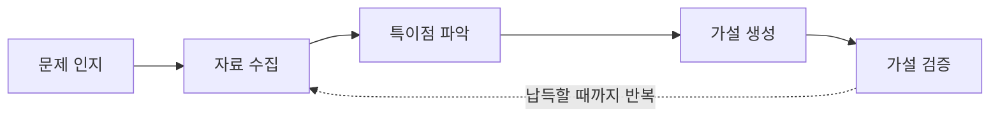
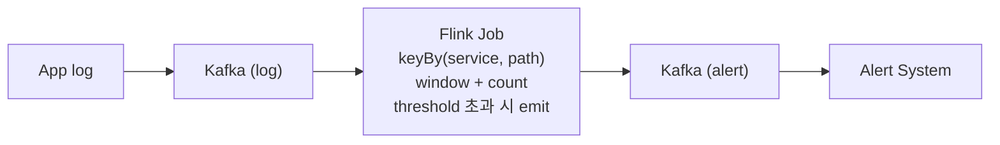
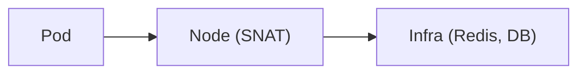
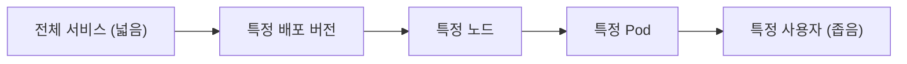

# 토스증권 SRE 팀의 RCA 접근 방식 정리

출처: 토스증권 SRE 팀의 RCA 접근 방식 발표

## 1. 핵심 요약

RCA(Root Cause Analysis)는 문제의 근본 원인을 찾는 과정이다.
토스증권 SRE 팀은 이를 5단계로 정의하고, 각 단계마다 목표를 두어
시스템과 절차를 만들었다.



| 단계 | 목표 | 구현 수단 |
| --- | --- | --- |
| 문제 인지 | 인지 시간 단축, 풍부한 컨텍스트 | Flink 스트리밍 알람, Change Story |
| 자료 수집 | 편의성, 접근성 | 자동 프로파일링, 노드 에이전트 |
| 특이점 파악 | 구체화(조사 범위 축소) | 정형 로그 분포, 연결 정보 테이블 |
| 가설 생성 | 명제 + 검증 근거/수집 방법 명시 | 가설 템플릿 |
| 가설 검증 | 수용/기각/보류 판단 | 재현, 원인 제거 후 관찰 |

## 2. 용어

| 용어 | 의미 |
| --- | --- |
| RCA | 장애나 문제의 근본 원인을 찾는 분석 과정 |
| 특이점 | 문제가 가지는 독자적인 속성. 원인 자체는 아니지만 조사 범위를 줄여 준다 |
| Change Story | 배포·인프라 작업 등 변경 이력을 한곳에 모은 통합 뷰 |
| conntrack | 리눅스 커널이 관리하는 연결 추적 테이블 |
| SNAT | 출발지 주소를 바꾸는 NAT. Pod 트래픽이 Node IP로 나가게 된다 |
| DaemonSet | K8s의 모든 노드에 Pod를 하나씩 배포하는 리소스 |

## 3. 문제 인지

### 3.1 목표

- **인지 시간 단축:** 인지가 늦으면 이후 모든 단계가 함께 늦어진다.
- **풍부한 컨텍스트:** 알람만 오면 담당자가 자료를 전부 수동으로 수집해야 한다.
  특이점 파악·가설 생성에 필요한 기본 인사이트를 알람에 포함한다.

### 3.2 Flink 기반 스트리밍 알람

기존에는 로그를 중간 저장소에 적재한 뒤 조회해 알람을 보냈기 때문에
첫 알람까지 수 분이 걸렸다. Flink 잡이 로그 Kafka를 직접 consume해
집계하도록 바꿔 수 초 수준으로 줄였다.



예시 (Flink DataStream API 의사 코드):

```java
env.addSource(kafkaLogSource)
    .filter(log -> log.level == ERROR)
    .keyBy(log -> log.serviceName + "|" + log.path)
    .window(TumblingProcessingTimeWindows.of(Time.seconds(10)))
    .aggregate(new ErrorCountAgg()) // (service, path, count)
    .filter(agg -> agg.count >= THRESHOLD)
    .addSink(kafkaAlertSink);
```

### 3.3 Change Story: 변경 이력 통합 뷰

대부분의 이슈는 변경에서 비롯되므로 알람에 변경 이력을 함께 보낸다.

- Aggregator 레이어가 FE 배포, BE 배포, 인프라 작업 이력 등을 가져와
  Change Story라는 중앙 DB에 저장한다.
- 알람 시스템은 이 통합 뷰를 조회해 변경 이력을 알람에 첨부한다.

예시 (통합 뷰 스키마):

| type | target | version / job | actor | at |
| --- | --- | --- | --- | --- |
| client | ios-app | 5.12.0 | ci-bot | 2026-10-05 09:40 |
| service | order-api | v2026.10.05-1 | alice | 2026-10-05 10:02 |
| infra | redis-cluster-a | node reboot | sre-bob | 2026-10-05 10:15 |

- `client` = FE 배포, `service` = BE 배포, 나머지 = 각 작업 이력

### 3.4 결과: 알람 예시

```text
[ERROR SPIKE] order-api POST /v1/orders
1) 통계 : 5xx 142건 / 10s (평소 0~2건), 영향 사용자 97명
2) 전송 : 발생 후 4초 만에 알람
3) 서비스 배포 이력 (최근 1h): 없음
4) 인프라 작업 이력 (최근 1h): 없음
```

## 4. 자료 수집

### 4.1 목표

- **편의성:** 자료 수집이 쉬워야 한다.
- **접근성:** 수집한 자료에 누구나 쉽게 접근할 수 있어야 한다.

### 4.2 편의성: 자동 프로파일링

- 어드민에서 수동 프로파일링을 지원했지만, 이슈 발생 시점을 예측할 수
  없어 사람이 매번 들어가는 방식은 지속 가능하지 않았다.
- 지정 스케줄 또는 메트릭 임계치 도달 시 자동으로 프로파일링을 수행한다.
- 증권업은 피크 트래픽 시점(장 시작 등)이 예측되므로 스케줄 방식이 유효하다.

예시 1: 평일 09:00마다 수집하는 스케줄 설정

```yaml
profiling:
  schedules:
    - name: market-open
      cron: "0 0 9 * * MON-FRI"
      targets: [order-api, quote-api]
      duration: 60s
      types: [cpu, alloc, lock]
```

예시 2: Grafana 알람 라벨로 트리거

```yaml
# Grafana alert rule
labels:
  severity: critical
  profiling: "true" # 이 라벨이 있으면 webhook이 프로파일링 요청
  profiling_target: order-api
```

### 4.3 접근성: 연결 정보의 영속화

가장 자주 쓰는 데이터는 연결 정보다. 이슈 해결 중 다음 질문이 자주 나온다.

- 이 서비스(Pod)는 어떤 인프라에 의존하는가?
- 이 인프라(Redis, DB)에 붙어 있는 클라이언트는 누구인가?

문제는 관측 지점에 따라 보이는 정보가 다르다는 점이다.



- 인프라 입장에서는 연결 출발지가 Node IP로 보인다. (Pod를 알 수 없음)
- Pod 입장에서는 Node 밖으로 나가는 NAT 연결을 알 수 없다.
- 한쪽 정보만으로는 두 질문에 모두 답할 수 없다.

**해결:** K8s 각 노드에 에이전트를 DaemonSet으로 배포해 노드 레벨에서
연결 정보를 수집하고 분석용 저장소에 적재한다.

예시 (에이전트가 실행하는 명령):

```bash
# 연결 추적 테이블: pod IP:port → NAT IP:port → 목적지 IP:port
conntrack -L -p tcp --state ESTABLISHED

# 특정 목적지로의 방화벽/도달 여부 확인
nc -zv -w 2 10.20.30.40 6379
```

예시 (적재된 연결 정보 테이블):

| node_ip | pod_name | pod_ip:port | nat_ip:port | dst_ip:port |
| --- | --- | --- | --- | --- |
| 10.0.1.11 | order-api-7f9 | 172.16.3.21:51234 | 10.0.1.11:40112 | 10.20.30.40:6379 |
| 10.0.1.11 | quote-api-c2d | 172.16.3.35:48810 | 10.0.1.11:40250 | 10.20.30.40:6379 |

- Pod, Node, Infra까지 통신에 관여하는 IP/port를 한 번에 볼 수 있다.
- 쿼리를 조금만 알면 누구나 다양한 방식으로 활용할 수 있다.

```sql
-- Redis 10.20.30.40:6379 에 붙어 있는 Pod 목록
SELECT pod_name, count(*) AS conns
FROM connection_info
WHERE dst_ip = '10.20.30.40' AND dst_port = 6379
GROUP BY pod_name
ORDER BY conns DESC;
```

## 5. 특이점 파악

### 5.1 정의와 목표

- **특이점:** 문제가 가지는 독자적인 속성. 그 자체가 원인은 아니지만
  조사해야 하는 범위를 줄여 준다.
- **목표:** 구체화. 문제가 어디서 발생하는지 최대한 좁힌다.
- User → Service → DB 구성에서 노드(특정 사용자, 서비스, DB)와
  간선(특정 호출 구간) 모두 특이점 후보가 된다.

### 5.2 수직 구체화: 계층 구조가 있을 때

사용자·배포환경처럼 명확한 계층이 있을 때 사용한다.
토스증권은 정형화된 로그를 쓰기 때문에 필드 분포만 보면 된다.

| 컨텍스트 | 로그 필드 |
| --- | --- |
| 사용자 | `user_id`, `device_id` |
| 배포환경 | `pod_name`, `host_name`, `deploy_version` |

에러가 특정 값에 몰려 있으면 그 값으로 범위를 좁힌다.
예를 들어 특정 Pod에만 집중되어 있으면 노드·배포 버전은 제외하고
해당 Pod만 본다.



예시 (분포 확인 쿼리):

```sql
SELECT deploy_version, pod_name, count(*) AS errors
FROM service_log
WHERE service = 'order-api' AND level = 'ERROR'
  AND ts BETWEEN '2026-10-05 10:00' AND '2026-10-05 10:10'
GROUP BY deploy_version, pod_name
ORDER BY errors DESC;
```

| deploy_version | pod_name | errors |
| --- | --- | --- |
| v2026.10.05-1 | order-api-7f9 | 138 |
| v2026.10.05-1 | order-api-c2d | 2 |
| v2026.10.05-1 | order-api-a1b | 2 |

→ 배포 버전은 동일하므로 제외하고, `order-api-7f9` Pod(와 그 노드)에 집중한다.

### 5.3 수평 구체화: 공통 영역을 볼 때

계층적 편향이 보이지 않으면 서비스가 공유하는 영역(미들웨어, 네트워크)을
점검한다. 원칙은 **문제가 있는 집단만이 가지는 특성**을 찾는 것이다.

- 연결 정보 테이블로 문제 서비스들이 공유하는 인프라를 확인한다.
- 공통 라이브러리가 제공하는 메트릭으로 문제 영역을 좁힌다.

예시:

```sql
-- 에러가 난 Pod 들만 공통으로 붙어 있는 목적지 찾기
SELECT dst_ip, dst_port, count(DISTINCT pod_name) AS pods
FROM connection_info
WHERE pod_name IN ('order-api-7f9', 'cart-api-3e1', 'pay-api-9k2')
GROUP BY dst_ip, dst_port
HAVING count(DISTINCT pod_name) = 3;
```

## 6. 가설 생성

앞선 모든 단계는 좋은 가설을 만들기 위한 기반이다.
특이점을 바탕으로 이를 유발할 수 있는 요인을 명제로 만든다.
가설에는 두 가지가 반드시 포함되어야 한다.

1. 검증하려는 명제 그 자체
2. 명제 검증에 필요한 근거와 그 수집 방법

예시 (가설 템플릿):

```text
특이점 : Redis 노드 A 의 conntrack 테이블이 가득 참
명제   : 애플리케이션 외 제3의 연결이 conntrack 을 점유하고 있다
근거   : Redis 에 연결된 클라이언트 중 앱 연결의 비율
수집   : redis-cli CLIENT LIST 로 IP:port 확보
         → 연결 정보 테이블의 nat_ip:port 와 매칭
판정   : 앱 외 연결 비율이 높으면 수용, 낮으면 기각
```

## 7. 가설 검증

- 논리적으로 타당하면 수용, 아니면 기각, 판단할 수 없으면 보류한다.
- 테스트 코드 작성과 유사하다: 예측값 정의 → 실측값 확보 → 비교
- 실측값 확보 방법
  - 테스트 환경에서 동일 이슈를 재현한다.
  - 재현이 어려우면 원인으로 의심되는 부분을 제거하고 추이를 관찰한다.

## 8. 사례: Redis 커넥션 타임아웃

### 8.1 문제 인지

2026년 어느 날 서비스에서 에러가 발생했다.
알람 시스템을 통해 최근 배포 이력, 작업 이력, 에러 통계에 특이 사항이
없음을 1차로 확인했다.

### 8.2 1회차

**자료 수집·특이점 파악**

- 서비스 로그 분석: 사용자·배포환경 특이점 없음
- 대신 다음 세 가지가 식별됨
  - 대부분의 로그가 Redis 관련 클래스에서 찍힘
  - 내용 대부분이 Redis connection timeout
  - 타겟 Redis 노드가 하나
- 해당 Redis 노드의 node exporter 메트릭과 커널 로그 확인 →
  `nf_conntrack: table full, dropping packet`
- limit이 260k로 충분히 큰 값인데도 가득 참

conntrack은 커널이 관리하는 연결 추적 테이블이다. 가득 차면
신규 연결을 받지 못하고 패킷을 드랍하므로 클라이언트는 connection
timeout을 받는다. → Redis 노드의 conntrack 테이블을 특이점으로 확정

```bash
# 커널 로그
dmesg | grep conntrack
# nf_conntrack: nf_conntrack: table full, dropping packet

# 현재 사용량 / 한도
cat /proc/sys/net/netfilter/nf_conntrack_count  # 260000
cat /proc/sys/net/netfilter/nf_conntrack_max    # 260000
```

**가설 1:** 원인은 애플리케이션과 무관한 인프라에 있다.

- 근거: 최근 애플리케이션 배포가 없었고, Redis 클러스터 중 한 노드만
  conntrack이 가득 참
- 필요 데이터: Redis 노드에 애플리케이션 외 연결이 많은가?

**검증**

1. Redis에 연결된 클라이언트 IP:port 목록 확보
2. 자료 수집 단계에서 적재해 둔 연결 정보 테이블의 `nat_ip:port`와 매칭
3. 매칭되면 앱 연결, 아니면 제3의 연결

```sql
SELECT c.client_ip, c.client_port,
       CASE WHEN ci.pod_name IS NULL THEN 'unknown' ELSE 'app' END AS kind,
       ci.pod_name
FROM redis_client_list c
LEFT JOIN connection_info ci
  ON ci.nat_ip = c.client_ip AND ci.nat_port = c.client_port
WHERE c.redis_node = '10.20.30.40';
```

결과: **기각**. 앱 외 연결이 유의미하게 많지 않았고, 오히려 80% 이상이
애플리케이션 연결이었다.

### 8.3 2회차

**자료 수집**

- 1회차 검증에서 "앱 연결이 conntrack의 80% 이상"이라는 단서를 얻어
  탐색 범위를 애플리케이션으로 좁힐 수 있게 됨
- 앱 → Redis 구간에서 커넥션이 어떻게 쓰이는지 보기 위해 tcpdump 수집
- conntrack 크기 추이에 주기성이 있어 스케줄 기반 자동 수집을 활용

**특이점 파악**

대부분의 요청은 기존 커넥션을 재사용하지만, 일부는 신규 연결을
맺고 끊는 패턴이 관찰됨.

```text
# tcpdump 발췌 (앱 → Redis)
# 1) 신규 연결
10:02:11.001 IP app.51234 > redis.6379: Flags [S]
10:02:11.002 IP redis.6379 > app.51234: Flags [S.]
10:02:11.002 IP app.51234 > redis.6379: Flags [.]
# 2) 인증
10:02:11.003 IP app.51234 > redis.6379: ... "AUTH" ...
10:02:11.004 IP app.51234 > redis.6379: ... "GET" / "SET" ...
# 3) 연결 종료
10:02:11.010 IP app.51234 > redis.6379: Flags [F.]
```

**가설 2:** 애플리케이션이 커넥션을 on-demand로 생성한다.
생성 속도가 커널이 정리하는 속도보다 빨라 conntrack이 가득 찬다.

- 필요 데이터: 애플리케이션에서 신규 커넥션을 생성하는 로직

코드 레벨에서 확인한 결과, Spring `RedisTemplate`의 pipeline 경로가
의심됐다. `executePipelined()`는 내부에서 `getConnection()`으로 커넥션을
얻고 완료 후 `releaseConnection()`으로 닫는다.

```java
// RedisTemplate.executePipelined() 흐름 (요약)
RedisConnection conn = RedisConnectionUtils.getConnection(factory);
try {
  conn.openPipeline();
  action.doInRedis(conn);
  return conn.closePipeline();
} finally {
  RedisConnectionUtils.releaseConnection(conn, factory);
}
```

Lettuce는 pipeline에 전용(dedicated) 커넥션을 쓰는데, 풀이 없으면
호출마다 네이티브 커넥션을 새로 만들고 release 시 닫는다.

**검증** (두 관점)

| 관점 | 방법 | 결과 |
| --- | --- | --- |
| 재현 | 테스트 환경에서 pipeline 사용 API 호출 후 tcpdump 확인 | 호출마다 신규 연결 생성·종료 (수집 단계와 동일 패턴) |
| 원인 제거 | pipeline 로직 제거 후 conntrack 추이 관찰 | 80K → 1.7K로 감소·안정화 |

두 근거를 확보했으므로 가설 **수용**, 이슈 종결.

### 8.4 사후 점검

- 유사 컴포넌트 재발 가능성 검토: 다른 서비스의 pipeline 사용 패턴을
  조사해 문제 없음을 확인
- conntrack 사용률 알람이 없어 서비스 에러가 난 뒤에야 인지했다는 점을
  확인하고, 인지 단계에 conntrack 사용률 알람 추가

예시 (추가한 알람 규칙):


```yaml
# Prometheus rule
- alert: ConntrackNearFull
  expr: node_nf_conntrack_entries / node_nf_conntrack_entries_limit > 0.7
  for: 2m
  labels: { severity: warning, profiling: "true" }
  annotations:
    summary: "{{ $labels.instance }} conntrack {{ $value | humanizePercentage }}"
```


예시 (발표에는 없는 보완안, 참고용): pipeline을 유지해야 한다면
전용 커넥션을 풀에서 가져오도록 설정해 매번 생성·종료되지 않게 한다.

```java
// commons-pool2 GenericObjectPoolConfig
LettucePoolingClientConfiguration cfg = LettucePoolingClientConfiguration
    .builder()
    .poolConfig(poolConfig)
    .build();

new LettuceConnectionFactory(standaloneConfig, cfg);
```

## 9. 교훈

1. **빠른 인지가 첫걸음이다.** 문제가 있는지조차 모르면 아무것도 못 한다.
2. **특이점 파악만 잘되면 대부분 해결된다.** 가장 어려운 일은 봐야 할
   구간과 아닌 구간을 나누는 것인데, 특이점이 이 분류를 돕는다.
3. **첫 번째 사이클을 빠르게 돌려라.** 사례에서도 1회차 가설을 검증하며
   얻은 데이터가 2회차 가설의 핵심 단서가 됐다. 막혀 있다면 가설이
   마음에 들지 않아도 일단 검증해 보는 것이 좋다.
