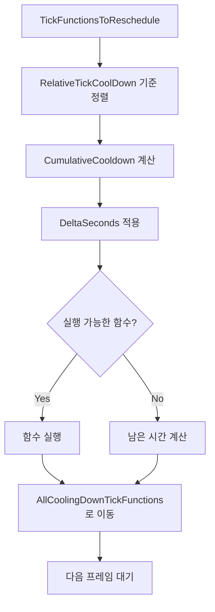

## Table of contents
{: .no_toc .text-delta }

1. TOC
{:toc}

---

## CoolingDownScheduling 시스템

### 개요
Unreal Engine의 CoolingDownScheduling은 TickFunction들의 실행 주기를 효율적으로 관리하는 시스템
* `TickFunctionsToReschedule`에서 `AllCoolingDownTickFunctions`로 TickFunction을 이동시키는 과정을 통해 동작

### 핵심 개념

#### 1. RelativeTickCoolDown의 도입 이유

**문제 상황:**
- TickFunction A: CoolDown이 3초
- TickFunction B: CoolDown이 9초
- 현재 DeltaSeconds가 5초라면 무엇을 실행해야 할까?

**답: 모른다**
CoolDown은 주기(period)이지 절대적인 실행 시점이 아니기 때문입니다.

**기존 해결책의 문제점:**
모든 TickFunction의 CoolDown을 감소시키는 방식은 비효율적입니다:
```cpp
// 비효율적인 방식
for (auto& TickFunction : AllTickFunctions) {
    TickFunction.CoolDown -= DeltaSeconds;
    if (TickFunction.CoolDown <= 0) {
        ExecuteTickFunction(TickFunction);
        TickFunction.CoolDown = OriginalCoolDown; // 원래 값으로 복원
    }
}
```

**RelativeTickCoolDown의 해결책:**
상대적 개념을 도입하여 효율성을 극대화합니다:

```cpp
// 효율적인 방식
TickFunction A: RelativeTickCoolDown = 3
TickFunction B: RelativeTickCoolDown = 9
현재 DeltaSeconds = 5

// 계산 과정
A의 남은 시간: 3 - 5 = -2 (실행됨)
B의 남은 시간: 9 - 5 = 4 (7초 후 실행 예정)
```

이 방식은 **가장 앞선 TickFunction만 조작**함으로써 효율성을 달성

#### 2. TickFunctionsToReschedule → AllCoolingDownTickFunctions 이동 과정

**상세 예시:**
```cpp
// 초기 상태
TickFunction A: CoolDown = 5초
TickFunction B: RelativeTickCoolDown = 3초  
TickFunction C: RelativeTickCoolDown = 9초
```

**정렬 과정:**
1. **RelativeTickCoolDown 기준 정렬**
   - B (3초) → A (5초) → C (9초) 순서로 정렬
   - 실행 우선순위: B → A → C

2. **CumulativeCooldown 계산**
   ```cpp
   // 정렬된 순서대로 누적 계산
   B: CumulativeCooldown = 3초
   A: CumulativeCooldown = 3 + 5 = 8초  
   C: CumulativeCooldown = 3 + 5 + 9 = 17초
   ```

3. **실행 시뮬레이션 (DeltaSeconds = 4초)**
   ```cpp
   // 각 TickFunction의 실행 가능 여부 확인
   B: 3 - 4 = -1 → 실행됨 (1초 전에 실행되었어야 함)
   A: 8 - 4 = 4 → 실행 안됨 (4초 후 실행 예정)
   C: 17 - 4 = 13 → 실행 안됨 (13초 후 실행 예정)
   ```

4. **재스케줄링**
   ```cpp
   // 실행된 TickFunction은 다시 CoolDown 주기로 설정
   B: RelativeTickCoolDown = 3초 (원래 CoolDown)
   
   // 실행되지 않은 TickFunction들은 남은 시간으로 조정
   A: RelativeTickCoolDown = 4초 (8 - 4)
   C: RelativeTickCoolDown = 13초 (17 - 4)
   ```

### 시스템 아키텍처

#### 데이터 구조
```cpp
class FTickFunction {
    float CoolDown;                    // 원본 주기
    float RelativeTickCoolDown;        // 상대적 남은 시간
    float CumulativeCooldown;          // 누적 시간
    bool bIsCoolingDown;               // 쿨다운 상태 여부
};

// 컨테이너들
TArray<FTickFunction*> TickFunctionsToReschedule;      // 스케줄링 대기 중
TArray<FTickFunction*> AllCoolingDownTickFunctions;    // 쿨다운 중인 함수들
```

#### 처리 플로우


### 성능 최적화

#### 1. 정렬 최적화
- **힙 정렬** 사용으로 O(n log n) 복잡도
- RelativeTickCoolDown 기준으로 최소 힙 구성

#### 2. 메모리 효율성
- 포인터 기반 관리로 메모리 복사 최소화
- 재할당 없는 컨테이너 사용

#### 3. 캐시 친화성
- 연속된 메모리 접근 패턴
- 브랜치 예측 최적화

### 실제 구현 예시

```cpp
void UWorld::TickCoolingDownFunctions(float DeltaSeconds) {
    // 1. 정렬 (RelativeTickCoolDown 기준)
    AllCoolingDownTickFunctions.Sort([](const FTickFunction* A, const FTickFunction* B) {
        return A->RelativeTickCoolDown < B->RelativeTickCoolDown;
    });
    
    // 2. CumulativeCooldown 계산
    float CumulativeTime = 0.0f;
    for (auto* TickFunction : AllCoolingDownTickFunctions) {
        CumulativeTime += TickFunction->CoolDown;
        TickFunction->CumulativeCooldown = CumulativeTime;
    }
    
    // 3. 실행 가능한 함수들 찾기
    TArray<FTickFunction*> FunctionsToExecute;
    for (auto* TickFunction : AllCoolingDownTickFunctions) {
        if (TickFunction->CumulativeCooldown <= DeltaSeconds) {
            FunctionsToExecute.Add(TickFunction);
        } else {
            break; // 정렬되어 있으므로 이후 함수들은 모두 실행 불가
        }
    }
    
    // 4. 함수 실행
    for (auto* TickFunction : FunctionsToExecute) {
        TickFunction->ExecuteTick();
        TickFunction->RelativeTickCoolDown = TickFunction->CoolDown;
    }
    
    // 5. 남은 시간 조정
    for (auto* TickFunction : AllCoolingDownTickFunctions) {
        if (!FunctionsToExecute.Contains(TickFunction)) {
            TickFunction->RelativeTickCoolDown -= DeltaSeconds;
        }
    }
}
```

### 장점과 특징

#### 1. 효율성
- **O(n log n)** 정렬 + **O(k)** 실행 (k는 실행 가능한 함수 수)
- 불필요한 반복 계산 제거

#### 2. 정확성
- 누적 시간 기반으로 정확한 실행 순서 보장
- 부동소수점 오차 최소화

#### 3. 확장성
- 동적으로 TickFunction 추가/제거 가능
- 다양한 주기 설정 지원

#### 4. 디버깅 친화성
- 각 단계별 상태 추적 가능
- 시각적 디버깅 도구 지원

### 주의사항

#### 1. 부동소수점 정밀도
```cpp
// 부정확한 비교
if (TickFunction->RelativeTickCoolDown <= DeltaSeconds) // 문제 가능

// 정확한 비교
if (TickFunction->RelativeTickCoolDown <= DeltaSeconds + SMALL_NUMBER) // 권장
```

#### 2. 메모리 관리
- TickFunction 생명주기 관리 주의
- 댕글링 포인터 방지

#### 3. 스레드 안전성
- 멀티스레드 환경에서의 동기화 필요
- 락 프리 구조 고려

