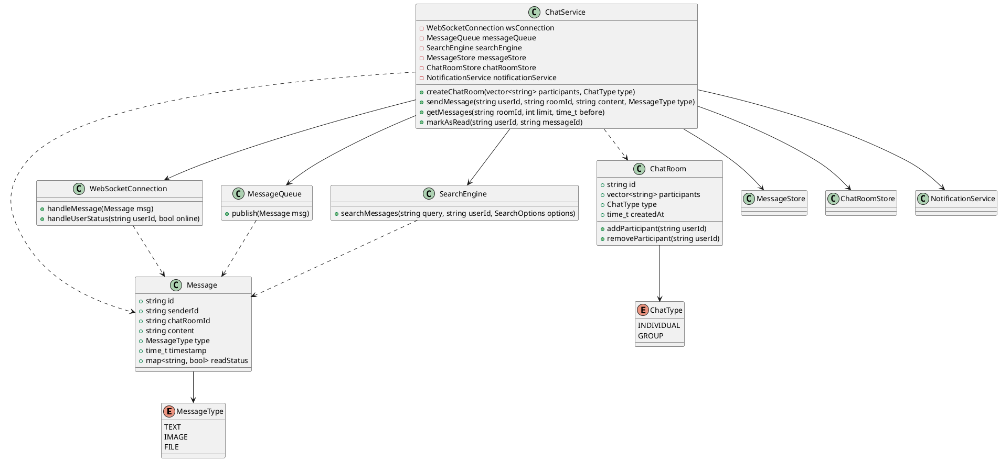

## Table of contents
{: .no_toc .text-delta }

1. TOC
{:toc}

---

## Q

* Slack과 같은 실시간 분산 채팅 시스템을 설계하세요.
* 다음 기능들이 필요합니다:
    * 1:1 채팅 및 그룹 채팅 지원
    * 메시지 전송/수신 (텍스트, 이미지, 파일)
    * 읽음 확인 기능
    * 온라인/오프라인 상태 표시
    * 메시지 검색 기능
    * 채팅방 참여자 관리
    * 알림 기능

---

## A

* 시스템 아키텍처:
    * 웹소켓 서버: 실시간 메시지 전송
    * 메시지 큐: 메시지 처리 및 전달 보장
    * 캐시 서버: 최근 메시지 및 사용자 상태 저장
    * 검색 엔진: 메시지 검색 기능 제공
* 데이터 모델:
    * 사용자 정보
    * 채팅방 정보
    * 메시지 데이터
    * 읽음 상태
* 확장성 고려사항:
    * 수평적 확장이 가능한 설계
    * 지역별 서버 분산
    * 메시지 전달 보장
* 성능 최적화:
    * 메시지 캐싱
    * 효율적인 연결 관리
    * 실시간 업데이트 최적화

```cpp
// 메시지 정의
class Message {
public:
    string id;
    string senderId;
    string chatRoomId;
    string content;
    MessageType type;  // TEXT, IMAGE, FILE
    time_t timestamp;
    map<string, bool> readStatus;  // userId -> read status
};

// 채팅방 관리
class ChatRoom {
public:
    string id;
    vector<string> participants;
    ChatType type;  // INDIVIDUAL, GROUP
    time_t createdAt;
    
    void addParticipant(string userId) {
        participants.push_back(userId);
        notifyParticipantChange(userId, true);
    }
    
    void removeParticipant(string userId) {
        auto it = find(participants.begin(), 
                      participants.end(), 
                      userId);
        if (it != participants.end()) {
            participants.erase(it);
            notifyParticipantChange(userId, false);
        }
    }
};

// 웹소켓 연결 관리
class WebSocketConnection {
public:
    void handleMessage(const Message& msg) {
        // 메시지 유효성 검사
        if (!validateMessage(msg)) {
            return;
        }
        
        // 메시지 큐에 전송
        messageQueue.publish(msg);
        
        // 온라인 사용자에게 즉시 전송
        for (auto& userId : msg.chatRoom->participants) {
            if (isUserOnline(userId)) {
                sendToUser(userId, msg);
            }
        }
    }
    
    void handleUserStatus(string userId, bool online) {
        userStatusCache.set(userId, online);
        notifyUserStatus(userId, online);
    }
};

// 메시지 큐 처리
class MessageQueue {
public:
    void publish(const Message& msg) {
        // 메시지 영속화
        messageStore.save(msg);
        
        // 읽지 않은 사용자들에게 알림 전송
        for (auto& userId : msg.chatRoom->participants) {
            if (userId != msg.senderId) {
                notificationService.sendNotification(userId, msg);
            }
        }
    }
};

// 검색 기능
class SearchEngine {
public:
    vector<Message> searchMessages(string query, 
                                 string userId,
                                 SearchOptions options) {
        vector<Message> results;
        
        // 사용자의 채팅방에서 검색
        auto chatRooms = getUserChatRooms(userId);
        for (auto& room : chatRooms) {
            auto messages = searchInRoom(room, query, options);
            results.insert(results.end(), 
                         messages.begin(), 
                         messages.end());
        }
        
        return results;
    }
};

// 채팅 서비스 메인 클래스
class ChatService {
public:
    ChatRoom* createChatRoom(vector<string> participants, 
                           ChatType type) {
        auto room = new ChatRoom();
        room->id = generateUniqueId();
        room->participants = participants;
        room->type = type;
        room->createdAt = getCurrentTime();
        
        chatRoomStore.save(room);
        return room;
    }
    
    void sendMessage(string userId, 
                    string roomId, 
                    string content,
                    MessageType type) {
        auto msg = new Message();
        msg->id = generateUniqueId();
        msg->senderId = userId;
        msg->chatRoomId = roomId;
        msg->content = content;
        msg->type = type;
        msg->timestamp = getCurrentTime();
        
        wsConnection.handleMessage(*msg);
    }
    
    vector<Message> getMessages(string roomId, 
                              int limit, 
                              time_t before) {
        return messageStore.getMessages(roomId, limit, before);
    }
    
    void markAsRead(string userId, string messageId) {
        auto msg = messageStore.getMessage(messageId);
        msg->readStatus[userId] = true;
        messageStore.update(msg);
        
        // 읽음 상태 변경 알림
        notifyReadStatus(msg);
    }
    
private:
    WebSocketConnection wsConnection;
    MessageQueue messageQueue;
    SearchEngine searchEngine;
    MessageStore messageStore;
    ChatRoomStore chatRoomStore;
    NotificationService notificationService;
};

// 사용 예제
int main() {
    ChatService chatService;
    
    // 채팅방 생성
    vector<string> participants = {"user1", "user2"};
    auto room = chatService.createChatRoom(participants, 
                                         ChatType::INDIVIDUAL);
    
    // 메시지 전송
    chatService.sendMessage("user1", 
                          room->id, 
                          "안녕하세요!", 
                          MessageType::TEXT);
    
    // 메시지 조회
    auto messages = chatService.getMessages(room->id, 50, 
                                          getCurrentTime());
    
    // 메시지 검색
    SearchOptions options;
    options.startDate = getYesterday();
    options.endDate = getCurrentTime();
    
    auto searchResults = 
        chatService.searchEngine.searchMessages("안녕", 
                                              "user1", 
                                              options);
    
    return 0;
}
```

이 설계는 다음과 같은 특징을 가집니다:

1. 실시간성
   * WebSocket을 통한 실시간 메시지 전송
   * 사용자 상태 실시간 업데이트

2. 신뢰성
   * 메시지 큐를 통한 메시지 전달 보장
   * 메시지 영속화

3. 확장성
   * 독립적으로 확장 가능한 컴포넌트
   * 분산 아키텍처 지원

4. 기능성
   * 다양한 메시지 타입 지원
   * 읽음 확인
   * 검색 기능
   * 알림 시스템

실제 구현시에는 다음 사항들을 추가로 고려해야 합니다:
* 보안 (메시지 암호화, 인증)
* 에러 처리
* 메시지 순서 보장
* 네트워크 지연 및 장애 처리
* 대규모 트래픽 처리

